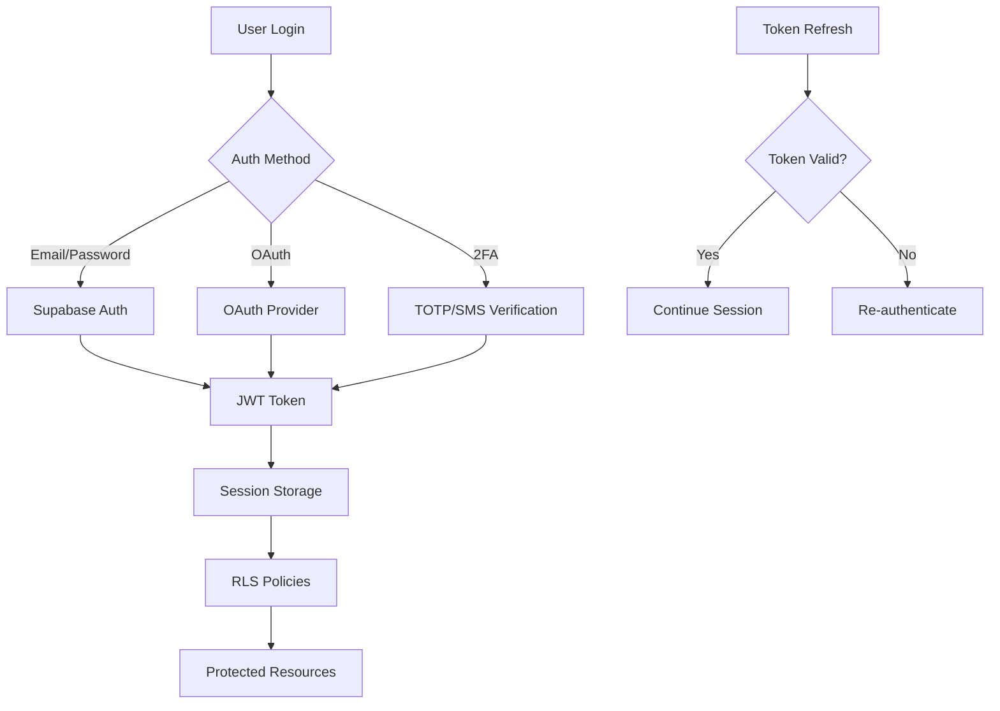

# المواصفات التقنية المفصلة

## 🏗️ معمارية النظام الشاملة

### Frontend Architecture

```
┌─────────────────────────────────────────────────────────────┐
│                    Frontend Layer                           │
├─────────────────────────────────────────────────────────────┤
│  Next.js 14 + React 18 + TypeScript 5                      │
│  ├── Pages Router (SSR/SSG)                                │
│  ├── API Routes (Edge Functions)                           │
│  ├── Middleware (Auth, i18n, Security)                     │
│  └── Static Assets (Images, Fonts, Icons)                  │
├─────────────────────────────────────────────────────────────┤
│  State Management                                           │
│  ├── React Query (Server State)                            │
│  ├── Zustand (Client State)                                │
│  ├── React Context (Auth, Theme, i18n)                     │
│  └── Local Storage (Preferences)                           │
├─────────────────────────────────────────────────────────────┤
│  UI Components                                              │
│  ├── Atomic Design Pattern                                 │
│  │   ├── Atoms (Button, Input, Icon)                       │
│  │   ├── Molecules (FormField, Card, Modal)                │
│  │   └── Organisms (Navbar, Dashboard, Tables)             │
│  ├── Tailwind CSS + CSS Variables                          │
│  ├── Framer Motion (Animations)                            │
│  └── Radix UI (Accessible Primitives)                      │
└─────────────────────────────────────────────────────────────┘
```

### Backend Architecture

```
┌─────────────────────────────────────────────────────────────┐
│                    Backend Layer                            │
├─────────────────────────────────────────────────────────────┤
│  Supabase Edge Functions                                   │
│  ├── Authentication (JWT, OAuth)                           │
│  ├── Real-time Subscriptions                               │
│  ├── File Storage                                          │
│  └── Database Triggers                                     │
├─────────────────────────────────────────────────────────────┤
│  Database Layer                                             │
│  ├── PostgreSQL 15+ (Primary)                              │
│  │   ├── Row Level Security (RLS)                          │
│  │   ├── Database Functions                                │
│  │   └── Triggers & Webhooks                               │
│  ├── Redis 7+ (Caching)                                    │
│  │   ├── Session Storage                                   │
│  │   ├── Rate Limiting                                     │
│  │   └── Real-time Data                                    │
│  └── ClickHouse (Analytics)                                │
│      ├── Time-series Data                                  │
│      ├── Aggregations                                      │
│      └── Reporting                                         │
├─────────────────────────────────────────────────────────────┤
│  External Integrations                                      │
│  ├── Trading APIs (MT4, MT5, TradingView)                  │
│  ├── Payment Gateways (Stripe, PayPal)                     │
│  ├── AI/ML Services (OpenAI, Custom Models)                │
│  ├── Messaging (Email, SMS, Push)                          │
│  └── Analytics (Google, Mixpanel)                          │
└─────────────────────────────────────────────────────────────┘
```

## 🎨 Design System المتقدم

### Color System

```scss
// Brand Colors
$primary: (
  50: #f0f9ff,
  100: #e0f2fe,
  200: #bae6fd,
  300: #7dd3fc,
  400: #38bdf8,
  500: #0ea5e9,  // Main brand color
  600: #0284c7,
  700: #0369a1,
  800: #075985,
  900: #0c4a6e,
  950: #082f49
);

// Semantic Colors
$success: #22c55e;
$warning: #f59e0b;
$error: #ef4444;
$info: #3b82f6;

// Neutral Colors
$gray: (
  50: #f8fafc,
  100: #f1f5f9,
  200: #e2e8f0,
  300: #cbd5e1,
  400: #94a3b8,
  500: #64748b,
  600: #475569,
  700: #334155,
  800: #1e293b,
  900: #0f172a,
  950: #020617
);
```

### Typography Scale

```scss
// Font Families
$font-arabic: 'IBM Plex Sans Arabic', system-ui, sans-serif;
$font-latin: 'Inter', system-ui, sans-serif;
$font-mono: 'JetBrains Mono', 'Fira Code', monospace;

// Font Sizes (Fluid Typography)
$text-xs: clamp(0.75rem, 0.7rem + 0.25vw, 0.875rem);
$text-sm: clamp(0.875rem, 0.8rem + 0.375vw, 1rem);
$text-base: clamp(1rem, 0.9rem + 0.5vw, 1.125rem);
$text-lg: clamp(1.125rem, 1rem + 0.625vw, 1.25rem);
$text-xl: clamp(1.25rem, 1.1rem + 0.75vw, 1.5rem);
$text-2xl: clamp(1.5rem, 1.3rem + 1vw, 2rem);
$text-3xl: clamp(1.875rem, 1.6rem + 1.375vw, 2.5rem);
$text-4xl: clamp(2.25rem, 1.9rem + 1.75vw, 3rem);
$text-5xl: clamp(3rem, 2.5rem + 2.5vw, 4rem);
$text-6xl: clamp(3.75rem, 3rem + 3.75vw, 5rem);
```

### Spacing System

```scss
// Spacing Scale (8px base)
$spacing: (
  0: 0,
  1: 0.25rem,   // 4px
  2: 0.5rem,    // 8px
  3: 0.75rem,   // 12px
  4: 1rem,      // 16px
  5: 1.25rem,   // 20px
  6: 1.5rem,    // 24px
  8: 2rem,      // 32px
  10: 2.5rem,   // 40px
  12: 3rem,     // 48px
  16: 4rem,     // 64px
  20: 5rem,     // 80px
  24: 6rem,     // 96px
  32: 8rem,     // 128px
  40: 10rem,    // 160px
  48: 12rem,    // 192px
  56: 14rem,    // 224px
  64: 16rem     // 256px
);
```

### Component Tokens

```scss
// Border Radius
$radius-sm: 0.25rem;
$radius-md: 0.375rem;
$radius-lg: 0.5rem;
$radius-xl: 0.75rem;
$radius-2xl: 1rem;
$radius-full: 9999px;

// Shadows
$shadow-sm: 0 1px 2px 0 rgb(0 0 0 / 0.05);
$shadow-md: 0 4px 6px -1px rgb(0 0 0 / 0.1), 0 2px 4px -2px rgb(0 0 0 / 0.1);
$shadow-lg: 0 10px 15px -3px rgb(0 0 0 / 0.1), 0 4px 6px -4px rgb(0 0 0 / 0.1);
$shadow-xl: 0 20px 25px -5px rgb(0 0 0 / 0.1), 0 8px 10px -6px rgb(0 0 0 / 0.1);
$shadow-2xl: 0 25px 50px -12px rgb(0 0 0 / 0.25);

// Animations
$transition-fast: 150ms ease;
$transition-base: 200ms ease;
$transition-slow: 300ms ease;
$transition-slower: 500ms ease;
```

## 🔐 Security Architecture

### Authentication Flow



### Security Layers

```
┌─────────────────────────────────────────────┐
│              Application Security            │
├─────────────────────────────────────────────┤
│  1. Input Validation & Sanitization        │
│     ├── XSS Prevention                     │
│     ├── SQL Injection Protection           │
│     ├── CSRF Tokens                        │
│     └── Rate Limiting                      │
├─────────────────────────────────────────────┤
│  2. Authentication & Authorization          │
│     ├── Multi-factor Authentication        │
│     ├── JWT with Refresh Tokens            │
│     ├── Role-based Access Control          │
│     └── Session Management                 │
├─────────────────────────────────────────────┤
│  3. Data Protection                         │
│     ├── Encryption at Rest                 │
│     ├── Encryption in Transit              │
│     ├── PII Data Masking                   │
│     └── Secure Key Management              │
├─────────────────────────────────────────────┤
│  4. Infrastructure Security                 │
│     ├── HTTPS/TLS 1.3                      │
│     ├── Security Headers                   │
│     ├── Content Security Policy            │
│     └── Network Segmentation               │
└─────────────────────────────────────────────┘
```

## 📊 Performance Optimization

### Frontend Performance

```typescript
// Code Splitting Strategy
const DashboardPage = lazy(() => import('@/pages/dashboard'));
const SignalsPage = lazy(() => import('@/pages/signals'));
const AnalyticsPage = lazy(() => import('@/pages/analytics'));

// Image Optimization
<Image
  src="/hero-image.jpg"
  alt="Platform Dashboard"
  width={1200}
  height={600}
  priority
  placeholder="blur"
  blurDataURL="data:image/jpeg;base64,..."
  sizes="(max-width: 768px) 100vw, (max-width: 1200px) 50vw, 33vw"
/>

// Font Optimization
const inter = Inter({
  subsets: ['latin'],
  display: 'swap',
  preload: true,
  fallback: ['system-ui', 'arial']
});
```

### Backend Performance

```sql
-- Database Optimization
-- Indexes for frequently queried columns
CREATE INDEX CONCURRENTLY idx_signals_created_at ON signals (created_at DESC);
CREATE INDEX CONCURRENTLY idx_users_email ON users (email);
CREATE INDEX CONCURRENTLY idx_sessions_user_id ON sessions (user_id);

-- Partial indexes for specific conditions
CREATE INDEX CONCURRENTLY idx_active_signals 
ON signals (symbol, created_at) 
WHERE status = 'active';

-- Composite indexes for complex queries
CREATE INDEX CONCURRENTLY idx_user_signals 
ON signals (user_id, created_at DESC, status);
```

### Caching Strategy

```typescript
// Redis Caching Layers
const cacheConfig = {
  // Static data (24 hours)
  static: {
    ttl: 24 * 60 * 60,
    keys: ['market_data', 'currency_pairs', 'system_config']
  },
  
  // Dynamic data (5 minutes)
  dynamic: {
    ttl: 5 * 60,
    keys: ['active_signals', 'user_portfolio', 'market_status']
  },
  
  // Real-time data (30 seconds)
  realtime: {
    ttl: 30,
    keys: ['live_prices', 'signal_updates', 'notifications']
  }
};
```

## 🌐 Internationalization (i18n)

### Language Support

```typescript
// i18n Configuration
const i18nConfig = {
  defaultLocale: 'ar',
  locales: ['ar', 'en'],
  defaultNS: 'common',
  namespaces: [
    'common',
    'navigation',
    'auth',
    'dashboard',
    'signals',
    'analytics',
    'billing',
    'errors'
  ],
  
  // RTL Support
  rtl: {
    ar: true,
    en: false
  },
  
  // Number & Date Formatting
  formatting: {
    ar: {
      currency: 'SAR',
      dateFormat: 'DD/MM/YYYY',
      timeFormat: '24h',
      numberFormat: 'arabic-indic'
    },
    en: {
      currency: 'USD',
      dateFormat: 'MM/DD/YYYY',
      timeFormat: '12h',
      numberFormat: 'western'
    }
  }
};
```

### RTL Layout System

```scss
// Logical Properties for RTL Support
.container {
  padding-inline-start: 1rem;
  padding-inline-end: 1rem;
  margin-inline: auto;
  border-inline-start: 1px solid;
}

// Direction-specific styles
.card {
  text-align: start;
  
  [dir="rtl"] & {
    .icon {
      transform: scaleX(-1);
    }
  }
  
  [dir="ltr"] & {
    .badge {
      right: 0.5rem;
    }
  }
}
```

## 🔄 State Management

### React Query Configuration

```typescript
// Query Client Setup
const queryClient = new QueryClient({
  defaultOptions: {
    queries: {
      staleTime: 5 * 60 * 1000, // 5 minutes
      cacheTime: 10 * 60 * 1000, // 10 minutes
      retry: (failureCount, error) => {
        // Don't retry on 4xx errors except 408, 429
        if (error?.status >= 400 && error?.status < 500 && 
            ![408, 429].includes(error.status)) {
          return false;
        }
        return failureCount < 3;
      },
      retryDelay: attemptIndex => Math.min(1000 * 2 ** attemptIndex, 30000),
    },
    mutations: {
      retry: 1,
    },
  },
});
```

### Zustand Store Structure

```typescript
// Global Store Slices
interface AppStore extends 
  AuthSlice,
  ThemeSlice,
  NotificationSlice,
  SignalSlice {
}

// Auth Slice
interface AuthSlice {
  user: User | null;
  session: Session | null;
  loading: boolean;
  setUser: (user: User | null) => void;
  setSession: (session: Session | null) => void;
  setLoading: (loading: boolean) => void;
}

// Signal Slice
interface SignalSlice {
  activeSignals: Signal[];
  signalHistory: Signal[];
  filters: SignalFilters;
  addSignal: (signal: Signal) => void;
  updateSignal: (id: string, updates: Partial<Signal>) => void;
  setFilters: (filters: SignalFilters) => void;
}
```

## 📱 Progressive Web App (PWA)

### Service Worker Configuration

```typescript
// PWA Configuration
const pwaConfig = {
  name: 'منصة الخدمات الرقمية',
  short_name: 'المنصة الرقمية',
  description: 'منصة تداول وإشارات ذكية',
  theme_color: '#0ea5e9',
  background_color: '#ffffff',
  display: 'standalone',
  orientation: 'portrait',
  start_url: '/',
  scope: '/',
  
  icons: [
    {
      src: '/icons/icon-72x72.png',
      sizes: '72x72',
      type: 'image/png',
      purpose: 'maskable any'
    },
    {
      src: '/icons/icon-192x192.png',
      sizes: '192x192',
      type: 'image/png',
      purpose: 'maskable any'
    },
    {
      src: '/icons/icon-512x512.png',
      sizes: '512x512',
      type: 'image/png',
      purpose: 'maskable any'
    }
  ],
  
  // Offline Strategy
  runtimeCaching: [
    {
      urlPattern: /^https:\/\/api\./,
      handler: 'StaleWhileRevalidate',
      options: {
        cacheName: 'api-cache',
        expiration: {
          maxEntries: 100,
          maxAgeSeconds: 60 * 60 * 24 // 24 hours
        }
      }
    }
  ]
};
```

## 🧪 Testing Strategy

### Test Architecture

```
tests/
├── unit/                    # Unit Tests
│   ├── components/         # Component tests
│   ├── hooks/              # Hook tests
│   ├── utils/              # Utility tests
│   └── services/           # Service tests
├── integration/            # Integration Tests
│   ├── api/                # API integration
│   ├── database/           # Database tests
│   └── auth/               # Auth flow tests
├── e2e/                    # End-to-End Tests
│   ├── user-flows/         # User journey tests
│   ├── cross-browser/      # Browser compatibility
│   └── performance/        # Performance tests
└── load/                   # Load Testing
    ├── stress/             # Stress tests
    ├── volume/             # Volume tests
    └── spike/              # Spike tests
```

### Test Configuration

```typescript
// Jest Configuration
export default {
  testEnvironment: 'jsdom',
  setupFilesAfterEnv: ['<rootDir>/tests/setup.ts'],
  moduleNameMapping: {
    '^@/(.*)$': '<rootDir>/src/$1',
    '\\.(css|less|scss|sass)$': 'identity-obj-proxy'
  },
  collectCoverageFrom: [
    'src/**/*.{ts,tsx}',
    '!src/**/*.d.ts',
    '!src/**/*.stories.tsx'
  ],
  coverageThreshold: {
    global: {
      branches: 80,
      functions: 80,
      lines: 80,
      statements: 80
    }
  }
};

// Playwright Configuration
export default {
  testDir: './tests/e2e',
  timeout: 30000,
  fullyParallel: true,
  forbidOnly: !!process.env.CI,
  retries: process.env.CI ? 2 : 0,
  workers: process.env.CI ? 1 : undefined,
  reporter: 'html',
  use: {
    baseURL: 'http://localhost:3000',
    trace: 'on-first-retry',
    video: 'retain-on-failure',
    screenshot: 'only-on-failure'
  },
  projects: [
    {
      name: 'chromium',
      use: { ...devices['Desktop Chrome'] }
    },
    {
      name: 'firefox',
      use: { ...devices['Desktop Firefox'] }
    },
    {
      name: 'webkit',
      use: { ...devices['Desktop Safari'] }
    },
    {
      name: 'Mobile Chrome',
      use: { ...devices['Pixel 5'] }
    },
    {
      name: 'Mobile Safari',
      use: { ...devices['iPhone 12'] }
    }
  ]
};
```

## 🔍 Monitoring & Analytics

### Application Monitoring

```typescript
// Sentry Configuration
Sentry.init({
  dsn: process.env.SENTRY_DSN,
  environment: process.env.NODE_ENV,
  tracesSampleRate: 1.0,
  beforeSend(event, hint) {
    // Filter sensitive data
    if (event.request?.url?.includes('/api/auth/')) {
      return null;
    }
    return event;
  },
  integrations: [
    new Integrations.BrowserTracing(),
    new Integrations.Replay()
  ]
});

// Performance Monitoring
const performanceObserver = new PerformanceObserver((list) => {
  list.getEntries().forEach((entry) => {
    if (entry.entryType === 'navigation') {
      analytics.track('Page Load Time', {
        page: window.location.pathname,
        loadTime: entry.loadEventEnd - entry.loadEventStart,
        domContentLoaded: entry.domContentLoadedEventEnd - entry.domContentLoadedEventStart
      });
    }
  });
});
```

### Business Analytics

```typescript
// Analytics Event Tracking
const trackingEvents = {
  // Authentication Events
  'user_signed_up': {
    properties: ['method', 'source', 'plan']
  },
  'user_signed_in': {
    properties: ['method', 'device_type']
  },
  
  // Trading Events
  'signal_viewed': {
    properties: ['signal_type', 'symbol', 'accuracy_score']
  },
  'signal_followed': {
    properties: ['signal_id', 'investment_amount']
  },
  
  // Engagement Events
  'dashboard_viewed': {
    properties: ['user_segment', 'session_duration']
  },
  'feature_used': {
    properties: ['feature_name', 'user_tier']
  }
};
```

---

**المراجع التقنية**
- [Next.js Documentation](https://nextjs.org/docs)
- [React Query Guide](https://tanstack.com/query/latest)
- [Tailwind CSS Reference](https://tailwindcss.com/docs)
- [Supabase Documentation](https://supabase.com/docs)
- [TypeScript Handbook](https://www.typescriptlang.org/docs)