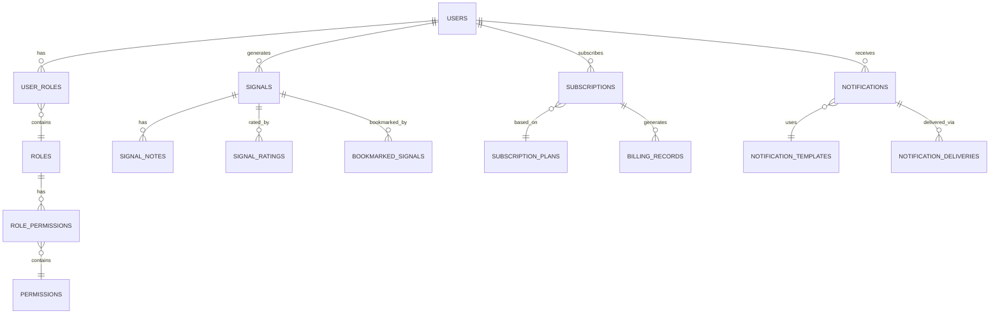

# خطة العمل الشاملة النهائية - منصة متكاملة للخدمات الرقمية المتطورة

## 🎯 نظرة عامة على المشروع

### الهدف الاستراتيجي
إنشاء منصة رقمية متكاملة تضم 15 نظامًا احترافيًا مترابطًا لتقديم خدمات متطورة في مجال التداول والإشارات الذكية، مع تطبيق أحدث التقنيات في الذكاء الاصطناعي، الأمان السيبراني، وتجربة المستخدم.

### الرؤية التقنية
بناء منصة قابلة للتوسع تدعم ملايين المستخدمين مع ضمان أداء عالي، أمان محكم، وتجربة مستخدم استثنائية عبر جميع الأجهزة والمنصات.

### القيمة المضافة
- **للمستخدمين**: إشارات دقيقة مدعومة بالذكاء الاصطناعي مع تحليلات شخصية متقدمة
- **للمطورين**: APIs شاملة ونظام إدارة متقدم
- **للإدارة**: لوحة تحكم شاملة مع مراقبة فورية وتحليلات عميقة

---

## 🏗️ التقنيات والمعمارية الأساسية

### Technology Stack المحدث

#### ✅ قاعدة البيانات والخدمات الخلفية (مكتمل)
- **✅ قاعدة البيانات الأساسية**: Supabase PostgreSQL 15+ مع Row Level Security (RLS)
- **⏳ قاعدة بيانات التحليلات**: ClickHouse للبيانات الضخمة والتحليلات المتقدمة
- **⏳ التخزين المؤقت**: Redis 7+ مع clustering للأداء العالي
- **⏳ Message Queue**: Apache Kafka للأحداث الفورية والتوسع
- **⏳ البحث المتقدم**: Elasticsearch للبحث الذكي والفلترة
- **✅ Functions**: Supabase Edge Functions مع TypeScript

#### ✅ الواجهة الأمامية والتجربة (مكتمل بنسبة 80%)
- **✅ Framework**: Next.js 14+ مع App Router
- **✅ UI Library**: React 18+ مع TypeScript 5+
- **✅ Styling**: Tailwind CSS 3+ مع design system مخصص
- **✅ State Management**: Zustand + React Query للأداء الأمثل
- **⏳ UI Components**: Radix UI + Headless UI + Framer Motion
- **✅ Internationalization**: next-i18next مع دعم RTL كامل

#### الذكاء الاصطناعي والتعلم الآلي
- **AI Platform**: OpenAI API + نماذج مخصصة
- **ML Framework**: TensorFlow.js للمعالجة المحلية
- **Data Processing**: Apache Airflow للمعالجة المجدولة
- **Model Management**: MLflow للإدارة المتقدمة
- **Real-time Analysis**: WebSocket للتحليل الفوري

#### DevOps والأمان
- **CI/CD**: GitHub Actions مع ArgoCD
- **Container**: Docker + Kubernetes للتوسع
- **Monitoring**: Prometheus + Grafana + Sentry
- **Security**: HashiCorp Vault + OWASP compliance
- **CDN**: Cloudflare مع Edge Computing

---

## 🎲 الأنظمة الـ15 المتكاملة - ترتيب الأولوية التنفيذية

### 🔴 المرحلة الأولى: الأساس التقني (الأسابيع 1-6)
**الأولوية: حرجة | لا يمكن المتابعة بدونها**

#### 1. نظام إدارة المستخدمين والمصادقة (User Management & Authentication)
**المدة: أسبوعين | الأهمية: أساسي**

**المكونات الأساسية:**
- مصادقة متعددة العوامل (2FA, TOTP, SMS, WebAuthn)
- OAuth 2.0 + OpenID Connect
- إدارة الجلسات المتقدمة
- Passwordless authentication
- Risk-based authentication

**قاعدة البيانات:**
```sql
-- جدول المستخدمين المحسن
CREATE TABLE users (
    id UUID PRIMARY KEY REFERENCES auth.users(id),
    email VARCHAR(255) UNIQUE NOT NULL,
    full_name VARCHAR(255),
    avatar_url TEXT,
    preferred_language VARCHAR(10) DEFAULT 'ar',
    timezone VARCHAR(50) DEFAULT 'Asia/Riyadh',
    phone_number VARCHAR(20),
    country_code VARCHAR(3),
    email_verified BOOLEAN DEFAULT false,
    phone_verified BOOLEAN DEFAULT false,
    two_factor_enabled BOOLEAN DEFAULT false,
    two_factor_secret TEXT,
    backup_codes TEXT[],
    risk_score INTEGER DEFAULT 0,
    last_login_at TIMESTAMP WITH TIME ZONE,
    last_login_ip INET,
    login_attempts INTEGER DEFAULT 0,
    locked_until TIMESTAMP WITH TIME ZONE,
    metadata JSONB DEFAULT '{}',
    created_at TIMESTAMP WITH TIME ZONE DEFAULT NOW(),
    updated_at TIMESTAMP WITH TIME ZONE DEFAULT NOW()
);

-- جدول جلسات المستخدمين المتقدم
CREATE TABLE user_sessions (
    id UUID PRIMARY KEY DEFAULT uuid_generate_v4(),
    user_id UUID REFERENCES users(id) ON DELETE CASCADE,
    session_token TEXT NOT NULL UNIQUE,
    refresh_token TEXT NOT NULL UNIQUE,
    device_info JSONB,
    ip_address INET,
    user_agent TEXT,
    geolocation JSONB,
    is_active BOOLEAN DEFAULT true,
    is_trusted BOOLEAN DEFAULT false,
    expires_at TIMESTAMP WITH TIME ZONE,
    last_activity TIMESTAMP WITH TIME ZONE DEFAULT NOW(),
    created_at TIMESTAMP WITH TIME ZONE DEFAULT NOW(),
    
    INDEX idx_user_sessions_user_id (user_id),
    INDEX idx_user_sessions_token (session_token),
    INDEX idx_user_sessions_active (is_active, expires_at)
);

-- جدول سجل الأمان
CREATE TABLE security_logs (
    id UUID PRIMARY KEY DEFAULT uuid_generate_v4(),
    user_id UUID REFERENCES users(id) ON DELETE CASCADE,
    event_type VARCHAR(50) NOT NULL,
    event_data JSONB,
    ip_address INET,
    user_agent TEXT,
    risk_level VARCHAR(20) DEFAULT 'low',
    created_at TIMESTAMP WITH TIME ZONE DEFAULT NOW(),
    
    INDEX idx_security_logs_user_id (user_id),
    INDEX idx_security_logs_event_type (event_type),
    INDEX idx_security_logs_created_at (created_at)
);
```

#### 2. نظام إدارة الصلاحيات والأدوار (RBAC)
**المدة: أسبوع ونصف | الأهمية: أساسي**

**المكونات الأساسية:**
- نظام أدوار هرمي متقدم
- صلاحيات دقيقة على مستوى الموارد
- Context-aware permissions
- Temporary permissions
- Audit trail شامل

**قاعدة البيانات:**
```sql
-- جدول الأدوار المحسن
CREATE TABLE roles (
    id UUID PRIMARY KEY DEFAULT uuid_generate_v4(),
    name VARCHAR(50) UNIQUE NOT NULL,
    display_name JSONB, -- متعدد اللغات
    description JSONB,
    parent_role_id UUID REFERENCES roles(id),
    level INTEGER DEFAULT 0,
    is_system_role BOOLEAN DEFAULT false,
    is_active BOOLEAN DEFAULT true,
    metadata JSONB DEFAULT '{}',
    created_at TIMESTAMP WITH TIME ZONE DEFAULT NOW(),
    updated_at TIMESTAMP WITH TIME ZONE DEFAULT NOW()
);

-- جدول الصلاحيات المتقدم
CREATE TABLE permissions (
    id UUID PRIMARY KEY DEFAULT uuid_generate_v4(),
    name VARCHAR(100) UNIQUE NOT NULL,
    display_name JSONB,
    resource VARCHAR(50) NOT NULL,
    action VARCHAR(50) NOT NULL,
    conditions JSONB, -- شروط السياق
    description JSONB,
    category VARCHAR(50),
    is_system_permission BOOLEAN DEFAULT false,
    created_at TIMESTAMP WITH TIME ZONE DEFAULT NOW()
);

-- جدول ربط الأدوار بالصلاحيات
CREATE TABLE role_permissions (
    id UUID PRIMARY KEY DEFAULT uuid_generate_v4(),
    role_id UUID REFERENCES roles(id) ON DELETE CASCADE,
    permission_id UUID REFERENCES permissions(id) ON DELETE CASCADE,
    granted_by UUID REFERENCES users(id),
    conditions JSONB,
    granted_at TIMESTAMP WITH TIME ZONE DEFAULT NOW(),
    expires_at TIMESTAMP WITH TIME ZONE,
    
    UNIQUE(role_id, permission_id)
);

-- جدول ربط المستخدمين بالأدوار
CREATE TABLE user_roles (
    id UUID PRIMARY KEY DEFAULT uuid_generate_v4(),
    user_id UUID REFERENCES users(id) ON DELETE CASCADE,
    role_id UUID REFERENCES roles(id) ON DELETE CASCADE,
    assigned_by UUID REFERENCES users(id),
    context JSONB, -- سياق التعيين
    assigned_at TIMESTAMP WITH TIME ZONE DEFAULT NOW(),
    expires_at TIMESTAMP WITH TIME ZONE,
    is_active BOOLEAN DEFAULT true,
    
    UNIQUE(user_id, role_id)
);

-- جدول مراجعة الصلاحيات
CREATE TABLE permission_audit (
    id UUID PRIMARY KEY DEFAULT uuid_generate_v4(),
    user_id UUID REFERENCES users(id),
    role_id UUID REFERENCES roles(id),
    permission_id UUID REFERENCES permissions(id),
    action_type VARCHAR(20), -- 'granted', 'revoked', 'used'
    resource_id UUID,
    result VARCHAR(20), -- 'allowed', 'denied'
    reason TEXT,
    ip_address INET,
    user_agent TEXT,
    created_at TIMESTAMP WITH TIME ZONE DEFAULT NOW(),
    
    INDEX idx_permission_audit_user_id (user_id),
    INDEX idx_permission_audit_created_at (created_at)
);
```

#### 3. نظام توليد الإشارات الذكية (Smart Signal Generation)
**المدة: أسبوعين ونصف | الأهمية: جوهري**

**المكونات الأساسية:**
- محرك AI متعدد النماذج
- تحليل تقني متقدم (50+ مؤشر)
- تحليل المشاعر والأخبار
- Backtesting engine
- Real-time market data processing

**قاعدة البيانات:**
```sql
-- جدول الإشارات المتقدم
CREATE TABLE signals (
    id UUID PRIMARY KEY DEFAULT uuid_generate_v4(),
    user_id UUID REFERENCES users(id) ON DELETE CASCADE,
    
    -- معلومات الإشارة الأساسية
    signal_type VARCHAR(50) NOT NULL, -- 'technical', 'ai', 'hybrid', 'sentiment'
    strategy_name VARCHAR(100),
    symbol VARCHAR(20) NOT NULL,
    timeframe VARCHAR(10) NOT NULL,
    direction VARCHAR(10) NOT NULL, -- 'CALL', 'PUT', 'BUY', 'SELL'
    
    -- أسعار ومستويات
    entry_price DECIMAL(15,8),
    current_price DECIMAL(15,8),
    target_price DECIMAL(15,8),
    stop_loss DECIMAL(15,8),
    take_profit DECIMAL(15,8),
    
    -- توقيت
    entry_time TIMESTAMP WITH TIME ZONE,
    expiry_time TIMESTAMP WITH TIME ZONE,
    duration_minutes INTEGER,
    
    -- تقييم ونتائج
    confidence_score INTEGER CHECK (confidence_score BETWEEN 0 AND 100),
    risk_level VARCHAR(20) DEFAULT 'medium',
    expected_payout DECIMAL(5,2),
    actual_payout DECIMAL(5,2),
    
    -- تحليل وبيانات
    technical_analysis JSONB,
    ai_analysis JSONB,
    sentiment_analysis JSONB,
    market_conditions JSONB,
    indicators_used TEXT[],
    
    -- حالة ونتائج
    status VARCHAR(20) DEFAULT 'pending', -- 'pending', 'active', 'won', 'lost', 'expired', 'cancelled'
    result_price DECIMAL(15,8),
    profit_loss DECIMAL(15,8),
    profit_loss_percentage DECIMAL(7,4),
    
    -- معلومات تقنية
    ai_model_version VARCHAR(50),
    data_sources TEXT[],
    execution_time_ms INTEGER,
    
    -- تصنيف ومشاركة
    category VARCHAR(50),
    tags TEXT[],
    is_public BOOLEAN DEFAULT false,
    is_premium BOOLEAN DEFAULT false,
    
    created_at TIMESTAMP WITH TIME ZONE DEFAULT NOW(),
    updated_at TIMESTAMP WITH TIME ZONE DEFAULT NOW(),
    
    -- فهارس للأداء
    INDEX idx_signals_user_id (user_id),
    INDEX idx_signals_symbol (symbol),
    INDEX idx_signals_status (status),
    INDEX idx_signals_created_at (created_at),
    INDEX idx_signals_expiry (expiry_time),
    INDEX idx_signals_performance (profit_loss_percentage),
    INDEX idx_signals_confidence (confidence_score)
);

-- جدول إعدادات توليد الإشارات
CREATE TABLE signal_generation_settings (
    user_id UUID PRIMARY KEY REFERENCES users(id) ON DELETE CASCADE,
    
    -- إعدادات عامة
    auto_generation_enabled BOOLEAN DEFAULT true,
    max_signals_per_day INTEGER DEFAULT 10,
    preferred_timeframes TEXT[] DEFAULT ARRAY['5m', '15m', '1h'],
    preferred_symbols TEXT[] DEFAULT ARRAY['EUR/USD', 'GBP/USD', 'USD/JPY'],
    
    -- إعدادات المخاطر
    max_risk_per_signal DECIMAL(5,2) DEFAULT 2.00,
    min_confidence_score INTEGER DEFAULT 70,
    risk_tolerance VARCHAR(20) DEFAULT 'medium',
    
    -- إعدادات AI والتحليل
    ai_models_enabled TEXT[] DEFAULT ARRAY['technical', 'sentiment'],
    technical_indicators TEXT[] DEFAULT ARRAY['RSI', 'MACD', 'EMA'],
    sentiment_sources TEXT[] DEFAULT ARRAY['news', 'social'],
    
    -- إعدادات التنبيهات
    notify_on_generation BOOLEAN DEFAULT true,
    notify_on_expiry BOOLEAN DEFAULT true,
    notify_on_result BOOLEAN DEFAULT true,
    
    updated_at TIMESTAMP WITH TIME ZONE DEFAULT NOW()
);

-- جدول بيانات السوق
CREATE TABLE market_data (
    id UUID PRIMARY KEY DEFAULT uuid_generate_v4(),
    symbol VARCHAR(20) NOT NULL,
    timeframe VARCHAR(10) NOT NULL,
    timestamp TIMESTAMP WITH TIME ZONE NOT NULL,
    
    -- OHLCV data
    open_price DECIMAL(15,8),
    high_price DECIMAL(15,8),
    low_price DECIMAL(15,8),
    close_price DECIMAL(15,8),
    volume BIGINT,
    
    -- مؤشرات محسوبة
    indicators JSONB,
    
    -- معلومات المصدر
    data_source VARCHAR(50),
    quality_score INTEGER DEFAULT 100,
    
    created_at TIMESTAMP WITH TIME ZONE DEFAULT NOW(),
    
    -- فهارس للأداء
    UNIQUE(symbol, timeframe, timestamp),
    INDEX idx_market_data_symbol_time (symbol, timeframe, timestamp),
    INDEX idx_market_data_timestamp (timestamp)
);

-- جدول أداء الاستراتيجيات
CREATE TABLE strategy_performance (
    id UUID PRIMARY KEY DEFAULT uuid_generate_v4(),
    strategy_name VARCHAR(100) NOT NULL,
    user_id UUID REFERENCES users(id),
    
    -- إحصائيات الأداء
    total_signals INTEGER DEFAULT 0,
    winning_signals INTEGER DEFAULT 0,
    losing_signals INTEGER DEFAULT 0,
    win_rate DECIMAL(5,2) DEFAULT 0,
    
    -- أرباح وخسائر
    total_profit_loss DECIMAL(15,8) DEFAULT 0,
    average_profit DECIMAL(15,8) DEFAULT 0,
    average_loss DECIMAL(15,8) DEFAULT 0,
    max_consecutive_wins INTEGER DEFAULT 0,
    max_consecutive_losses INTEGER DEFAULT 0,
    
    -- مقاييس المخاطر
    sharpe_ratio DECIMAL(10,6),
    max_drawdown DECIMAL(5,2),
    volatility DECIMAL(5,2),
    
    -- فترة التقييم
    period_start TIMESTAMP WITH TIME ZONE,
    period_end TIMESTAMP WITH TIME ZONE,
    
    created_at TIMESTAMP WITH TIME ZONE DEFAULT NOW(),
    updated_at TIMESTAMP WITH TIME ZONE DEFAULT NOW(),
    
    UNIQUE(strategy_name, user_id, period_start)
);
```

### 🟡 المرحلة الثانية: الخدمات الأساسية (الأسابيع 7-12)

#### 4. نظام سجل الإشارات وتحليلها (Signal History & Analysis)
**المدة: أسبوعين | الأهمية: عالي**

**المكونات الأساسية:**
- محرك بحث متقدم وفلترة ذكية
- تصدير متعدد الصيغ (CSV, PDF, Excel)
- إحصائيات وتحليلات متقدمة
- مقارنة الأداء والbenchmarking
- ملاحظات وتقييمات تفاعلية

**قاعدة البيانات:**
```sql
-- جدول ملاحظات الإشارات المحسن
CREATE TABLE signal_notes (
    id UUID PRIMARY KEY DEFAULT uuid_generate_v4(),
    signal_id UUID REFERENCES signals(id) ON DELETE CASCADE,
    user_id UUID REFERENCES users(id) ON DELETE CASCADE,
    
    note_type VARCHAR(20) DEFAULT 'general', -- 'general', 'analysis', 'lesson', 'strategy'
    title VARCHAR(255),
    content TEXT NOT NULL,
    content_format VARCHAR(20) DEFAULT 'text', -- 'text', 'markdown', 'html'
    
    -- تصنيف وتنظيم
    tags TEXT[],
    category VARCHAR(50),
    is_private BOOLEAN DEFAULT true,
    is_important BOOLEAN DEFAULT false,
    
    -- مراجعة وتقييم
    rating INTEGER CHECK (rating BETWEEN 1 AND 5),
    sentiment VARCHAR(20), -- 'positive', 'negative', 'neutral'
    
    -- مرفقات
    attachments JSONB,
    
    created_at TIMESTAMP WITH TIME ZONE DEFAULT NOW(),
    updated_at TIMESTAMP WITH TIME ZONE DEFAULT NOW(),
    
    INDEX idx_signal_notes_signal_id (signal_id),
    INDEX idx_signal_notes_user_id (user_id),
    INDEX idx_signal_notes_created_at (created_at)
);

-- جدول تقييمات الإشارات المحسن
CREATE TABLE signal_ratings (
    id UUID PRIMARY KEY DEFAULT uuid_generate_v4(),
    signal_id UUID REFERENCES signals(id) ON DELETE CASCADE,
    user_id UUID REFERENCES users(id) ON DELETE CASCADE,
    
    -- تقييمات متعددة الأبعاد
    overall_rating INTEGER CHECK (overall_rating BETWEEN 1 AND 5),
    accuracy_rating INTEGER CHECK (accuracy_rating BETWEEN 1 AND 5),
    timing_rating INTEGER CHECK (timing_rating BETWEEN 1 AND 5),
    analysis_quality INTEGER CHECK (analysis_quality BETWEEN 1 AND 5),
    
    -- مراجعة نصية
    review_title VARCHAR(255),
    review_text TEXT,
    
    -- معلومات إضافية
    would_follow_again BOOLEAN,
    helpful_votes INTEGER DEFAULT 0,
    total_votes INTEGER DEFAULT 0,
    
    created_at TIMESTAMP WITH TIME ZONE DEFAULT NOW(),
    updated_at TIMESTAMP WITH TIME ZONE DEFAULT NOW(),
    
    UNIQUE(signal_id, user_id)
);

-- جدول الإشارات المحفوظة المحسن
CREATE TABLE bookmarked_signals (
    id UUID PRIMARY KEY DEFAULT uuid_generate_v4(),
    user_id UUID REFERENCES users(id) ON DELETE CASCADE,
    signal_id UUID REFERENCES signals(id) ON DELETE CASCADE,
    
    bookmark_type VARCHAR(20) DEFAULT 'favorite', -- 'favorite', 'watchlist', 'study'
    folder_name VARCHAR(100),
    notes TEXT,
    reminder_date TIMESTAMP WITH TIME ZONE,
    
    bookmarked_at TIMESTAMP WITH TIME ZONE DEFAULT NOW(),
    
    UNIQUE(user_id, signal_id, bookmark_type),
    INDEX idx_bookmarked_signals_user_id (user_id),
    INDEX idx_bookmarked_signals_folder (user_id, folder_name)
);

-- جدول عمليات التصدير
CREATE TABLE signal_exports (
    id UUID PRIMARY KEY DEFAULT uuid_generate_v4(),
    user_id UUID REFERENCES users(id) ON DELETE CASCADE,
    
    export_type VARCHAR(20) NOT NULL, -- 'csv', 'pdf', 'excel', 'json'
    export_format VARCHAR(20) DEFAULT 'standard', -- 'standard', 'detailed', 'summary'
    
    -- معايير التصدير
    filters JSONB,
    date_range JSONB,
    columns_selected TEXT[],
    include_notes BOOLEAN DEFAULT false,
    include_analysis BOOLEAN DEFAULT false,
    
    -- معلومات الملف
    file_name VARCHAR(255),
    file_path TEXT,
    file_size BIGINT,
    download_count INTEGER DEFAULT 0,
    
    -- حالة العملية
    status VARCHAR(20) DEFAULT 'processing', -- 'processing', 'completed', 'failed', 'expired'
    progress_percentage INTEGER DEFAULT 0,
    error_message TEXT,
    
    -- صلاحية
    expires_at TIMESTAMP WITH TIME ZONE DEFAULT (NOW() + INTERVAL '7 days'),
    
    created_at TIMESTAMP WITH TIME ZONE DEFAULT NOW(),
    completed_at TIMESTAMP WITH TIME ZONE,
    
    INDEX idx_signal_exports_user_id (user_id),
    INDEX idx_signal_exports_status (status),
    INDEX idx_signal_exports_created_at (created_at)
);

-- جدول إحصائيات الأداء الشخصي
CREATE TABLE user_performance_stats (
    id UUID PRIMARY KEY DEFAULT uuid_generate_v4(),
    user_id UUID REFERENCES users(id) ON DELETE CASCADE,
    
    -- فترة الإحصائية
    period_type VARCHAR(20) NOT NULL, -- 'daily', 'weekly', 'monthly', 'yearly'
    period_start TIMESTAMP WITH TIME ZONE NOT NULL,
    period_end TIMESTAMP WITH TIME ZONE NOT NULL,
    
    -- إحصائيات الإشارات
    total_signals INTEGER DEFAULT 0,
    successful_signals INTEGER DEFAULT 0,
    failed_signals INTEGER DEFAULT 0,
    pending_signals INTEGER DEFAULT 0,
    win_rate DECIMAL(5,2) DEFAULT 0,
    
    -- إحصائيات مالية
    total_profit_loss DECIMAL(15,8) DEFAULT 0,
    total_invested DECIMAL(15,8) DEFAULT 0,
    roi_percentage DECIMAL(7,4) DEFAULT 0,
    average_profit_per_signal DECIMAL(15,8) DEFAULT 0,
    
    -- إحصائيات الأداء
    best_performing_symbol VARCHAR(20),
    worst_performing_symbol VARCHAR(20),
    most_used_timeframe VARCHAR(10),
    average_confidence_score DECIMAL(5,2),
    
    -- مقاييس المخاطر
    max_loss_single_signal DECIMAL(15,8),
    max_profit_single_signal DECIMAL(15,8),
    consistency_score DECIMAL(5,2),
    
    created_at TIMESTAMP WITH TIME ZONE DEFAULT NOW(),
    
    UNIQUE(user_id, period_type, period_start),
    INDEX idx_user_performance_user_period (user_id, period_type, period_start)
);
```

#### 5. نظام التنبيهات والإشعارات الذكية (Smart Notifications)
**المدة: أسبوعين | الأهمية: عالي**

**المكونات الأساسية:**
- إشعارات متعددة القنوات (Email, SMS, Push, In-app, Telegram)
- ذكاء اصطناعي لتحسين التوقيت
- قوالب قابلة للتخصيص
- نظام أولويات متقدم
- تتبع معدلات التفاعل

**قاعدة البيانات:**
```sql
-- جدول الإشعارات المتقدم
CREATE TABLE notifications (
    id UUID PRIMARY KEY DEFAULT uuid_generate_v4(),
    user_id UUID REFERENCES users(id) ON DELETE CASCADE,
    
    -- تصنيف الإشعار
    notification_type VARCHAR(50) NOT NULL,
    category VARCHAR(50), -- 'signal', 'subscription', 'security', 'system', 'marketing'
    priority VARCHAR(20) DEFAULT 'normal', -- 'low', 'normal', 'high', 'urgent'
    
    -- محتوى الإشعار
    title VARCHAR(255) NOT NULL,
    message TEXT NOT NULL,
    rich_content JSONB, -- HTML content, images, buttons
    action_data JSONB, -- data for action buttons
    
    -- قنوات التوصيل
    channels TEXT[] NOT NULL, -- ['in_app', 'email', 'sms', 'push', 'telegram']
    delivery_preferences JSONB,
    
    -- توقيت وجدولة
    scheduled_for TIMESTAMP WITH TIME ZONE,
    optimal_delivery_time TIMESTAMP WITH TIME ZONE, -- AI-optimized time
    expires_at TIMESTAMP WITH TIME ZONE,
    
    -- حالة التوصيل
    status VARCHAR(20) DEFAULT 'pending', -- 'pending', 'sent', 'delivered', 'failed', 'expired'
    delivery_attempts INTEGER DEFAULT 0,
    last_attempt_at TIMESTAMP WITH TIME ZONE,
    
    -- تفاعل المستخدم
    read_at TIMESTAMP WITH TIME ZONE,
    clicked_at TIMESTAMP WITH TIME ZONE,
    action_taken VARCHAR(50),
    interaction_data JSONB,
    
    -- تجميع وسلاسل
    group_id UUID, -- for grouping related notifications
    thread_id UUID, -- for notification threads
    
    created_at TIMESTAMP WITH TIME ZONE DEFAULT NOW(),
    updated_at TIMESTAMP WITH TIME ZONE DEFAULT NOW(),
    
    INDEX idx_notifications_user_id (user_id),
    INDEX idx_notifications_status (status),
    INDEX idx_notifications_scheduled (scheduled_for),
    INDEX idx_notifications_type (notification_type),
    INDEX idx_notifications_created_at (created_at)
);

-- جدول إعدادات الإشعارات المحسن
CREATE TABLE notification_settings (
    user_id UUID PRIMARY KEY REFERENCES users(id) ON DELETE CASCADE,
    
    -- إعدادات القنوات العامة
    email_enabled BOOLEAN DEFAULT true,
    email_address VARCHAR(255),
    sms_enabled BOOLEAN DEFAULT false,
    sms_number VARCHAR(20),
    push_enabled BOOLEAN DEFAULT true,
    in_app_enabled BOOLEAN DEFAULT true,
    telegram_enabled BOOLEAN DEFAULT false,
    telegram_chat_id VARCHAR(100),
    telegram_username VARCHAR(100),
    
    -- إعدادات حسب نوع الإشعار
    signal_notifications JSONB DEFAULT '{"email": true, "push": true, "in_app": true}',
    subscription_notifications JSONB DEFAULT '{"email": true, "in_app": true}',
    security_notifications JSONB DEFAULT '{"email": true, "sms": true, "in_app": true}',
    marketing_notifications JSONB DEFAULT '{"email": false, "in_app": false}',
    system_notifications JSONB DEFAULT '{"email": true, "in_app": true}',
    
    -- تفضيلات التوقيت
    quiet_hours_enabled BOOLEAN DEFAULT false,
    quiet_hours_start TIME,
    quiet_hours_end TIME,
    timezone VARCHAR(50) DEFAULT 'UTC',
    preferred_delivery_time TIME DEFAULT '09:00:00',
    
    -- إعدادات متقدمة
    frequency_limit VARCHAR(20) DEFAULT 'normal', -- 'minimal', 'normal', 'all'
    digest_mode BOOLEAN DEFAULT false,
    digest_frequency VARCHAR(20) DEFAULT 'daily', -- 'hourly', 'daily', 'weekly'
    intelligent_timing BOOLEAN DEFAULT true,
    
    updated_at TIMESTAMP WITH TIME ZONE DEFAULT NOW()
);

-- جدول قوالب الإشعارات
CREATE TABLE notification_templates (
    id UUID PRIMARY KEY DEFAULT uuid_generate_v4(),
    
    template_key VARCHAR(100) UNIQUE NOT NULL,
    category VARCHAR(50),
    
    -- محتوى متعدد اللغات
    content JSONB NOT NULL, -- {"ar": {...}, "en": {...}}
    
    -- إعدادات القالب
    default_channels TEXT[],
    priority VARCHAR(20) DEFAULT 'normal',
    expiry_hours INTEGER DEFAULT 24,
    
    -- متغيرات القالب
    variables TEXT[], -- list of supported variables
    required_data JSONB, -- schema for required data
    
    -- حالة القالب
    is_active BOOLEAN DEFAULT true,
    version INTEGER DEFAULT 1,
    
    created_at TIMESTAMP WITH TIME ZONE DEFAULT NOW(),
    updated_at TIMESTAMP WITH TIME ZONE DEFAULT NOW(),
    
    INDEX idx_notification_templates_key (template_key),
    INDEX idx_notification_templates_category (category)
);

-- جدول تسليم الإشعارات
CREATE TABLE notification_deliveries (
    id UUID PRIMARY KEY DEFAULT uuid_generate_v4(),
    notification_id UUID REFERENCES notifications(id) ON DELETE CASCADE,
    
    channel VARCHAR(20) NOT NULL,
    provider VARCHAR(50), -- 'sendgrid', 'twilio', 'firebase', etc.
    
    -- حالة التسليم
    status VARCHAR(20) DEFAULT 'pending', -- 'pending', 'sent', 'delivered', 'failed', 'bounced'
    attempt_count INTEGER DEFAULT 0,
    
    -- تفاصيل التسليم
    external_id VARCHAR(255), -- provider's delivery ID
    recipient_address VARCHAR(255),
    sent_at TIMESTAMP WITH TIME ZONE,
    delivered_at TIMESTAMP WITH TIME ZONE,
    failed_at TIMESTAMP WITH TIME ZONE,
    
    -- معلومات الخطأ
    error_code VARCHAR(50),
    error_message TEXT,
    bounce_reason TEXT,
    
    -- معلومات التفاعل
    opened_at TIMESTAMP WITH TIME ZONE,
    clicked_at TIMESTAMP WITH TIME ZONE,
    unsubscribed_at TIMESTAMP WITH TIME ZONE,
    
    created_at TIMESTAMP WITH TIME ZONE DEFAULT NOW(),
    
    INDEX idx_notification_deliveries_notification (notification_id),
    INDEX idx_notification_deliveries_channel (channel),
    INDEX idx_notification_deliveries_status (status)
);

-- جدول اشتراكات Push Notifications
CREATE TABLE push_subscriptions (
    id UUID PRIMARY KEY DEFAULT uuid_generate_v4(),
    user_id UUID REFERENCES users(id) ON DELETE CASCADE,
    
    -- بيانات الاشتراك
    endpoint TEXT NOT NULL,
    p256dh_key TEXT NOT NULL,
    auth_key TEXT NOT NULL,
    
    -- معلومات الجهاز
    device_type VARCHAR(20), -- 'desktop', 'mobile', 'tablet'
    browser_name VARCHAR(50),
    browser_version VARCHAR(20),
    os_name VARCHAR(50),
    os_version VARCHAR(20),
    user_agent TEXT,
    
    -- حالة الاشتراك
    is_active BOOLEAN DEFAULT true,
    last_used TIMESTAMP WITH TIME ZONE DEFAULT NOW(),
    
    -- إحصائيات
    successful_deliveries INTEGER DEFAULT 0,
    failed_deliveries INTEGER DEFAULT 0,
    
    created_at TIMESTAMP WITH TIME ZONE DEFAULT NOW(),
    
    UNIQUE(endpoint),
    INDEX idx_push_subscriptions_user_id (user_id),
    INDEX idx_push_subscriptions_active (is_active, last_used)
);

-- جدول إحصائيات الإشعارات
CREATE TABLE notification_analytics (
    id UUID PRIMARY KEY DEFAULT uuid_generate_v4(),
    
    -- فترة التقرير
    period_type VARCHAR(20) NOT NULL, -- 'hourly', 'daily', 'weekly', 'monthly'
    period_start TIMESTAMP WITH TIME ZONE NOT NULL,
    period_end TIMESTAMP WITH TIME ZONE NOT NULL,
    
    -- تصنيف
    notification_type VARCHAR(50),
    channel VARCHAR(20),
    user_segment VARCHAR(50), -- 'free', 'premium', 'enterprise'
    
    -- إحصائيات الإرسال
    total_sent INTEGER DEFAULT 0,
    total_delivered INTEGER DEFAULT 0,
    total_failed INTEGER DEFAULT 0,
    total_bounced INTEGER DEFAULT 0,
    
    -- إحصائيات التفاعل
    total_opened INTEGER DEFAULT 0,
    total_clicked INTEGER DEFAULT 0,
    total_unsubscribed INTEGER DEFAULT 0,
    
    -- معدلات
    delivery_rate DECIMAL(5,2) DEFAULT 0,
    open_rate DECIMAL(5,2) DEFAULT 0,
    click_rate DECIMAL(5,2) DEFAULT 0,
    unsubscribe_rate DECIMAL(5,2) DEFAULT 0,
    
    created_at TIMESTAMP WITH TIME ZONE DEFAULT NOW(),
    
    UNIQUE(period_type, period_start, notification_type, channel, user_segment),
    INDEX idx_notification_analytics_period (period_type, period_start)
);
```

#### 6. نظام الاشتراكات والفوترة المتقدم (Advanced Subscription & Billing)
**المدة: أسبوعين ونصف | الأهمية: عالي جداً**

**المكونات الأساسية:**
- خطط اشتراك متدرجة ومرنة
- دعم متعدد العملات والمناطق
- فوترة ذكية وحساب الضرائب
- إدارة الكوبونات والخصومات
- تكامل شامل مع Stripe وPayPal

**قاعدة البيانات:**
```sql
-- جدول خطط الاشتراك المحسن
CREATE TABLE subscription_plans (
    id UUID PRIMARY KEY DEFAULT uuid_generate_v4(),
    
    -- معلومات الخطة الأساسية
    name VARCHAR(100) NOT NULL,
    slug VARCHAR(100) UNIQUE NOT NULL,
    display_name JSONB, -- متعدد اللغات
    description JSONB,
    
    -- التسعير
    base_price DECIMAL(10,2) NOT NULL,
    currency VARCHAR(3) DEFAULT 'USD',
    billing_interval VARCHAR(20) NOT NULL, -- 'monthly', 'quarterly', 'yearly', 'lifetime'
    billing_interval_count INTEGER DEFAULT 1,
    
    -- تسعير متدرج حسب المنطقة
    regional_pricing JSONB, -- {"US": 29.99, "EU": 24.99, "MENA": 19.99}
    
    -- المميزات والحدود
    features JSONB, -- قائمة الميزات المتاحة
    limits JSONB, -- الحدود والقيود
    max_signals_per_day INTEGER,
    max_signals_per_month INTEGER,
    max_api_calls_per_day INTEGER,
    
    -- ميزات متقدمة
    ai_features_enabled BOOLEAN DEFAULT false,
    advanced_analytics BOOLEAN DEFAULT false,
    api_access_enabled BOOLEAN DEFAULT false,
    priority_support BOOLEAN DEFAULT false,
    custom_indicators BOOLEAN DEFAULT false,
    white_label_enabled BOOLEAN DEFAULT false,
    
    -- إعدادات التجربة المجانية
    trial_days INTEGER DEFAULT 0,
    trial_features JSONB,
    
    -- حالة الخطة
    is_active BOOLEAN DEFAULT true,
    is_featured BOOLEAN DEFAULT false,
    sort_order INTEGER DEFAULT 0,
    
    -- تكامل مع مقدمي الخدمة
    stripe_price_id VARCHAR(100),
    stripe_product_id VARCHAR(100),
    paypal_plan_id VARCHAR(100),
    
    -- معلومات التسويق
    marketing_features TEXT[],
    recommended_for TEXT[],
    upgrade_path UUID REFERENCES subscription_plans(id),
    
    created_at TIMESTAMP WITH TIME ZONE DEFAULT NOW(),
    updated_at TIMESTAMP WITH TIME ZONE DEFAULT NOW(),
    
    INDEX idx_subscription_plans_active (is_active, sort_order),
    INDEX idx_subscription_plans_price (base_price, currency)
);

-- جدول اشتراكات المستخدمين المحسن
CREATE TABLE subscriptions (
    id UUID PRIMARY KEY DEFAULT uuid_generate_v4(),
    user_id UUID REFERENCES users(id) ON DELETE CASCADE,
    plan_id UUID REFERENCES subscription_plans(id),
    
    -- معلومات الفوترة الخارجية
    stripe_subscription_id VARCHAR(100),
    stripe_customer_id VARCHAR(100),
    paypal_subscription_id VARCHAR(100),
    
    -- حالة الاشتراك
    status VARCHAR(20) NOT NULL, -- 'trialing', 'active', 'past_due', 'canceled', 'unpaid', 'incomplete'
    health_status VARCHAR(20) DEFAULT 'healthy', -- 'healthy', 'at_risk', 'churned'
    
    -- فترات الفوترة
    current_period_start TIMESTAMP WITH TIME ZONE,
    current_period_end TIMESTAMP WITH TIME ZONE,
    next_billing_date TIMESTAMP WITH TIME ZONE,
    
    -- إعدادات الإلغاء والتجديد
    cancel_at_period_end BOOLEAN DEFAULT false,
    canceled_at TIMESTAMP WITH TIME ZONE,
    cancellation_reason VARCHAR(100),
    cancellation_feedback TEXT,
    
    -- فترة التجربة المجانية
    trial_start TIMESTAMP WITH TIME ZONE,
    trial_end TIMESTAMP WITH TIME ZONE,
    trial_extended_days INTEGER DEFAULT 0,
    
    -- تخصيصات الخطة
    custom_features JSONB,
    custom_limits JSONB,
    discount_percentage DECIMAL(5,2) DEFAULT 0,
    
    -- إحصائيات الاستخدام
    usage_stats JSONB,
    last_usage TIMESTAMP WITH TIME ZONE,
    
    -- معلومات مالية
    mrr DECIMAL(10,2), -- Monthly Recurring Revenue
    total_paid DECIMAL(15,2) DEFAULT 0,
    
    created_at TIMESTAMP WITH TIME ZONE DEFAULT NOW(),
    updated_at TIMESTAMP WITH TIME ZONE DEFAULT NOW(),
    
    INDEX idx_subscriptions_user_id (user_id),
    INDEX idx_subscriptions_status (status),
    INDEX idx_subscriptions_plan_id (plan_id),
    INDEX idx_subscriptions_billing (next_billing_date),
    INDEX idx_subscriptions_trial (trial_end)
);

-- جدول سجلات الفوترة المحسن
CREATE TABLE billing_records (
    id UUID PRIMARY KEY DEFAULT uuid_generate_v4(),
    subscription_id UUID REFERENCES subscriptions(id),
    user_id UUID REFERENCES users(id),
    
    -- معلومات خارجية
    stripe_invoice_id VARCHAR(100),
    stripe_payment_intent_id VARCHAR(100),
    paypal_order_id VARCHAR(100),
    
    -- تفاصيل الفاتورة
    invoice_number VARCHAR(50),
    amount_subtotal DECIMAL(10,2),
    amount_tax DECIMAL(10,2),
    amount_discount DECIMAL(10,2),
    amount_total DECIMAL(10,2),
    currency VARCHAR(3),
    
    -- حالة الدفع
    status VARCHAR(20), -- 'draft', 'pending', 'paid', 'failed', 'refunded', 'disputed'
    payment_method VARCHAR(50), -- 'card', 'bank_transfer', 'paypal', 'crypto'
    payment_details JSONB,
    
    -- توقيت الفاتورة
    billing_reason VARCHAR(50), -- 'subscription_cycle', 'subscription_create', 'subscription_update'
    period_start TIMESTAMP WITH TIME ZONE,
    period_end TIMESTAMP WITH TIME ZONE,
    due_date TIMESTAMP WITH TIME ZONE,
    paid_at TIMESTAMP WITH TIME ZONE,
    
    -- تفاصيل الضرائب
    tax_rate DECIMAL(5,4),
    tax_region VARCHAR(10),
    tax_details JSONB,
    
    -- معلومات إضافية
    description TEXT,
    line_items JSONB, -- تفاصيل عناصر الفاتورة
    metadata JSONB,
    
    -- إعادة المحاولة والفشل
    retry_count INTEGER DEFAULT 0,
    last_retry_at TIMESTAMP WITH TIME ZONE,
    failure_reason TEXT,
    
    created_at TIMESTAMP WITH TIME ZONE DEFAULT NOW(),
    updated_at TIMESTAMP WITH TIME ZONE DEFAULT NOW(),
    
    INDEX idx_billing_records_subscription (subscription_id),
    INDEX idx_billing_records_user (user_id),
    INDEX idx_billing_records_status (status),
    INDEX idx_billing_records_date (created_at),
    INDEX idx_billing_records_period (period_start, period_end)
);

-- جدول كوبونات الخصم المحسن
CREATE TABLE coupons (
    id UUID PRIMARY KEY DEFAULT uuid_generate_v4(),
    
    -- معلومات الكوبون الأساسية
    code VARCHAR(50) UNIQUE NOT NULL,
    name VARCHAR(100),
    description JSONB, -- متعدد اللغات
    
    -- نوع الخصم
    discount_type VARCHAR(20) NOT NULL, -- 'percentage', 'fixed_amount', 'free_trial_extension'
    discount_value DECIMAL(10,2) NOT NULL,
    currency VARCHAR(3), -- required for fixed_amount
    
    -- قيود الاستخدام
    max_redemptions INTEGER,
    max_redemptions_per_user INTEGER DEFAULT 1,
    used_count INTEGER DEFAULT 0,
    
    -- صلاحية الكوبون
    valid_from TIMESTAMP WITH TIME ZONE,
    valid_until TIMESTAMP WITH TIME ZONE,
    
    -- قيود الخطة والمستخدم
    applicable_plans UUID[], -- array of plan IDs
    user_restrictions JSONB, -- {"new_users_only": true, "countries": ["US", "CA"]}
    minimum_amount DECIMAL(10,2),
    
    -- حالة الكوبون
    is_active BOOLEAN DEFAULT true,
    is_stackable BOOLEAN DEFAULT false,
    
    -- تكامل خارجي
    stripe_coupon_id VARCHAR(100),
    paypal_coupon_id VARCHAR(100),
    
    -- معلومات التسويق
    campaign_name VARCHAR(100),
    source VARCHAR(50), -- 'marketing', 'support', 'affiliate', 'automatic'
    
    created_at TIMESTAMP WITH TIME ZONE DEFAULT NOW(),
    updated_at TIMESTAMP WITH TIME ZONE DEFAULT NOW(),
    
    INDEX idx_coupons_code (code),
    INDEX idx_coupons_active (is_active, valid_from, valid_until),
    INDEX idx_coupons_campaign (campaign_name)
);

-- جدول استخدام الكوبونات
CREATE TABLE coupon_usage (
    id UUID PRIMARY KEY DEFAULT uuid_generate_v4(),
    coupon_id UUID REFERENCES coupons(id) ON DELETE CASCADE,
    user_id UUID REFERENCES users(id) ON DELETE CASCADE,
    subscription_id UUID REFERENCES subscriptions(id),
    billing_record_id UUID REFERENCES billing_records(id),
    
    -- تفاصيل الاستخدام
    discount_amount DECIMAL(10,2),
    currency VARCHAR(3),
    
    -- سياق الاستخدام
    applied_to VARCHAR(50), -- 'subscription', 'invoice', 'trial_extension'
    context_data JSONB,
    
    used_at TIMESTAMP WITH TIME ZONE DEFAULT NOW(),
    
    UNIQUE(coupon_id, user_id, subscription_id),
    INDEX idx_coupon_usage_coupon (coupon_id),
    INDEX idx_coupon_usage_user (user_id),
    INDEX idx_coupon_usage_date (used_at)
);

-- جدول تحليلات الاشتراكات
CREATE TABLE subscription_analytics (
    id UUID PRIMARY KEY DEFAULT uuid_generate_v4(),
    
    -- فترة التقرير
    period_type VARCHAR(20) NOT NULL, -- 'daily', 'weekly', 'monthly', 'quarterly', 'yearly'
    period_start TIMESTAMP WITH TIME ZONE NOT NULL,
    period_end TIMESTAMP WITH TIME ZONE NOT NULL,
    
    -- تصنيف
    plan_id UUID REFERENCES subscription_plans(id),
    user_segment VARCHAR(50),
    region VARCHAR(10),
    
    -- مقاييس الاشتراكات
    new_subscriptions INTEGER DEFAULT 0,
    canceled_subscriptions INTEGER DEFAULT 0,
    reactivated_subscriptions INTEGER DEFAULT 0,
    upgraded_subscriptions INTEGER DEFAULT 0,
    downgraded_subscriptions INTEGER DEFAULT 0,
    
    -- مقاييس مالية
    total_revenue DECIMAL(15,2) DEFAULT 0,
    recurring_revenue DECIMAL(15,2) DEFAULT 0,
    one_time_revenue DECIMAL(15,2) DEFAULT 0,
    refunded_amount DECIMAL(15,2) DEFAULT 0,
    
    -- مقاييس الأداء
    churn_rate DECIMAL(5,4) DEFAULT 0,
    retention_rate DECIMAL(5,4) DEFAULT 0,
    mrr_growth_rate DECIMAL(5,4) DEFAULT 0,
    ltv DECIMAL(10,2) DEFAULT 0, -- Customer Lifetime Value
    cac DECIMAL(10,2) DEFAULT 0, -- Customer Acquisition Cost
    
    -- مقاييس التجربة المجانية
    trial_conversions INTEGER DEFAULT 0,
    trial_conversion_rate DECIMAL(5,4) DEFAULT 0,
    
    created_at TIMESTAMP WITH TIME ZONE DEFAULT NOW(),
    
    UNIQUE(period_type, period_start, plan_id, user_segment, region),
    INDEX idx_subscription_analytics_period (period_type, period_start)
);

-- جدول معالجة المدفوعات الفاشلة
CREATE TABLE failed_payment_recovery (
    id UUID PRIMARY KEY DEFAULT uuid_generate_v4(),
    subscription_id UUID REFERENCES subscriptions(id) ON DELETE CASCADE,
    billing_record_id UUID REFERENCES billing_records(id),
    user_id UUID REFERENCES users(id),
    
    -- تفاصيل الفشل
    failure_reason VARCHAR(100),
    failure_code VARCHAR(50),
    amount DECIMAL(10,2),
    currency VARCHAR(3),
    
    -- استراتيجية الاستعادة
    recovery_strategy VARCHAR(50), -- 'dunning', 'payment_method_update', 'discount_offer'
    recovery_status VARCHAR(20) DEFAULT 'pending', -- 'pending', 'in_progress', 'recovered', 'failed'
    
    -- محاولات الاستعادة
    recovery_attempts INTEGER DEFAULT 0,
    max_recovery_attempts INTEGER DEFAULT 3,
    next_retry_at TIMESTAMP WITH TIME ZONE,
    
    -- نتائج الاستعادة
    recovered_at TIMESTAMP WITH TIME ZONE,
    recovered_amount DECIMAL(10,2),
    final_status VARCHAR(20), -- 'recovered', 'churned', 'downgraded'
    
    created_at TIMESTAMP WITH TIME ZONE DEFAULT NOW(),
    updated_at TIMESTAMP WITH TIME ZONE DEFAULT NOW(),
    
    INDEX idx_failed_payment_recovery_subscription (subscription_id),
    INDEX idx_failed_payment_recovery_status (recovery_status),
    INDEX idx_failed_payment_recovery_retry (next_retry_at)
);
```

### 🟢 المرحلة الثالثة: أنظمة التكامل والتوسع (الأسابيع 13-18)

#### 7. نظام التكامل مع المنصات الخارجية (External Integration Hub)
**المدة: أسبوعين ونصف | الأهمية: متوسط عالي**

**المكونات الأساسية:**
- تكامل مع منصات التداول (Binance, MetaTrader, Bybit, eToro)
- ربط مع مزودي البيانات (Yahoo Finance, Alpha Vantage, IEX Cloud)
- تكامل مع أدوات التحليل (TradingView, Pine Script)
- نظام OAuth آمن لإدارة API Keys
- مراقبة حالة التكاملات وإشعارات الأخطاء

#### 8. نظام التحليلات الشخصية والعامة (Advanced Analytics)
**المدة: أسبوعين | الأهمية: متوسط عالي**

**المكونات الأساسية:**
- تحليلات سلوك المستخدم المتقدمة
- dashboard تفاعلي بمقاييس الأداء
- تقارير مخصصة قابلة للتصدير
- مقارنات benchmarking مع المستخدمين الآخرين
- تحليل الاتجاهات والأنماط

#### 9. نظام التوصيات والذكاء الاصطناعي (AI Recommendation Engine)
**المدة: ثلاثة أسابيع | الأهمية: متوسط عالي**

**المكونات الأساسية:**
- محرك توصيات ذكي مبني على ML
- تخصيص المحتوى حسب سلوك المستخدم
- نظام تقييم التوصيات وتحسينها
- توصيات استراتيجيات تداول مخصصة
- تحليل المخاطر الشخصي

### 🔵 المرحلة الرابعة: أنظمة التطوير والإدارة (الأسابيع 19-22)

#### 10. نظام إدارة API للمطورين (Developer API Management)
**المدة: أسبوعين | الأهمية: متوسط**

#### 11. نظام CI/CD والتحديثات (CI/CD & Feature Management)
**المدة: أسبوع ونصف | الأهمية: متوسط**

#### 12. نظام مراقبة الأداء والتنبيهات الفنية (System Monitoring)
**المدة: أسبوعين ونصف | الأهمية: عالي**

### 🟣 المرحلة الخامسة: أنظمة الدعم والخدمات (الأسابيع 23-24)

#### 13. نظام الشكاوى والدعم الفني (Support & Ticketing)
**المدة: أسبوع ونصف | الأهمية: متوسط**

#### 14. نظام النسخ الاحتياطي والاستعادة (Backup & Recovery)
**المدة: أسبوع | الأهمية: عالي**

#### 15. نظام الشارات التحفيزية (Gamification)
**المدة: نصف أسبوع | الأهمية: منخفض**

---

## 🏢 هيكل المشروع التقني الشامل

### التنظيم العام للمجلدات
```
platform-root/
├── 📁 infrastructure/
│   ├── terraform/              # Infrastructure as Code
│   ├── kubernetes/             # K8s manifests and Helm charts
│   ├── monitoring/             # Prometheus, Grafana configs
│   └── security/               # Security policies and configs
├── 📁 backend/
│   ├── supabase/
│   │   ├── schema/             # Database schemas for all 15 systems
│   │   │   ├── 01_auth_rbac.sql
│   │   │   ├── 02_signals.sql
│   │   │   ├── 03_notifications.sql
│   │   │   ├── 04_subscriptions.sql
│   │   │   ├── 05_integrations.sql
│   │   │   ├── 06_analytics.sql
│   │   │   ├── 07_ai_recommendations.sql
│   │   │   ├── 08_api_management.sql
│   │   │   ├── 09_monitoring.sql
│   │   │   ├── 10_support.sql
│   │   │   ├── 11_backup.sql
│   │   │   └── 12_gamification.sql
│   │   ├── functions/          # Edge Functions
│   │   │   ├── auth/
│   │   │   ├── signals/
│   │   │   ├── notifications/
│   │   │   ├── payments/
│   │   │   ├── integrations/
│   │   │   ├── analytics/
│   │   │   ├── ai/
│   │   │   └── system/
│   │   ├── policies/           # RLS Policies
│   │   └── seed/               # Initial data
│   ├── microservices/
│   │   ├── ai-engine/          # ML models and AI processing
│   │   ├── data-processor/     # Market data processing
│   │   ├── notification-hub/   # Multi-channel notifications
│   │   └── integration-gateway/ # External API gateway
│   └── shared/
│       ├── types/              # TypeScript definitions
│       ├── utils/              # Shared utilities
│       └── constants/          # Application constants
├── 📁 frontend/
│   ├── apps/
│   │   ├── web/                # Main web application
│   │   ├── admin/              # Admin dashboard
│   │   └── mobile/             # React Native app
│   ├── packages/
│   │   ├── ui/                 # Design system components
│   │   ├── utils/              # Shared utilities
│   │   ├── config/             # Shared configuration
│   │   └── types/              # Shared TypeScript types
│   └── tools/
│       ├── build/              # Build tools and scripts
│       └── testing/            # Testing utilities
├── 📁 docs/
│   ├── architecture/           # System architecture docs
│   ├── api/                    # API documentation
│   ├── deployment/             # Deployment guides
│   ├── development/            # Development guides
│   └── user/                   # User documentation
├── 📁 scripts/
│   ├── deployment/             # Deployment scripts
│   ├── migration/              # Database migration scripts
│   ├── monitoring/             # Monitoring setup scripts
│   └── backup/                 # Backup and restore scripts
├── 📁 tests/
│   ├── unit/                   # Unit tests
│   ├── integration/            # Integration tests
│   ├── e2e/                    # End-to-end tests
│   └── performance/            # Performance tests
└── 📁 tools/
    ├── ci-cd/                  # CI/CD pipeline configurations
    ├── development/            # Development tools
    └── deployment/             # Deployment automation
```

---

## 🎨 دليل التصميم الموحد والواجهة

### مبادئ التصميم الأساسية

#### 1. Design System المتقدم
```typescript
// Design Tokens
export const designTokens = {
  colors: {
    primary: {
      50: '#f0f9ff',
      500: '#3b82f6',
      900: '#1e3a8a'
    },
    semantic: {
      success: '#10b981',
      warning: '#f59e0b',
      error: '#ef4444',
      info: '#3b82f6'
    },
    neutral: {
      50: '#f9fafb',
      500: '#6b7280',
      900: '#111827'
    }
  },
  typography: {
    fontFamily: {
      sans: ['Inter', 'system-ui', 'sans-serif'],
      mono: ['JetBrains Mono', 'monospace'],
      arabic: ['IBM Plex Sans Arabic', 'system-ui']
    },
    fontSize: {
      xs: '0.75rem',
      sm: '0.875rem',
      base: '1rem',
      lg: '1.125rem',
      xl: '1.25rem'
    }
  },
  spacing: {
    xs: '0.25rem',
    sm: '0.5rem',
    md: '1rem',
    lg: '1.5rem',
    xl: '2rem'
  },
  borderRadius: {
    sm: '0.25rem',
    md: '0.375rem',
    lg: '0.5rem',
    xl: '0.75rem'
  }
};
```

#### 2. Component Architecture
```typescript
// Atomic Design Structure
interface ComponentProps {
  variant?: 'primary' | 'secondary' | 'outline';
  size?: 'sm' | 'md' | 'lg';
  isLoading?: boolean;
  isDisabled?: boolean;
  children: React.ReactNode;
}

// Base Button Component
export const Button: React.FC<ComponentProps> = ({
  variant = 'primary',
  size = 'md',
  isLoading = false,
  isDisabled = false,
  children,
  ...props
}) => {
  const baseClasses = 'inline-flex items-center justify-center font-medium transition-colors';
  const variantClasses = {
    primary: 'bg-primary-500 text-white hover:bg-primary-600',
    secondary: 'bg-gray-200 text-gray-900 hover:bg-gray-300',
    outline: 'border border-gray-300 text-gray-700 hover:bg-gray-50'
  };
  const sizeClasses = {
    sm: 'px-3 py-2 text-sm',
    md: 'px-4 py-2 text-base',
    lg: 'px-6 py-3 text-lg'
  };

  return (
    <button
      className={cn(
        baseClasses,
        variantClasses[variant],
        sizeClasses[size],
        isDisabled && 'opacity-50 cursor-not-allowed',
        isLoading && 'cursor-wait'
      )}
      disabled={isDisabled || isLoading}
      {...props}
    >
      {isLoading && <Spinner className="mr-2" />}
      {children}
    </button>
  );
};
```

#### 3. Responsive Design Guidelines
```css
/* Mobile-first breakpoints */
@screen sm { /* 640px */ }
@screen md { /* 768px */ }
@screen lg { /* 1024px */ }
@screen xl { /* 1280px */ }
@screen 2xl { /* 1536px */ }

/* RTL Support */
.rtl {
  direction: rtl;
  text-align: right;
}

.rtl .ml-4 {
  margin-left: 0;
  margin-right: 1rem;
}

/* Dark mode support */
@media (prefers-color-scheme: dark) {
  .dark-mode {
    --bg-primary: #1f2937;
    --text-primary: #f9fafb;
  }
}
```

#### 4. Accessibility Standards
```typescript
// WCAG 2.1 AA Compliance
export const accessibilityUtils = {
  // Color contrast ratios
  colorContrast: {
    normal: 4.5, // AA level
    large: 3.0   // AA level for large text
  },
  
  // ARIA attributes helper
  getAriaAttributes: (role: string, label: string) => ({
    role,
    'aria-label': label,
    'aria-describedby': `${label}-description`,
    tabIndex: 0
  }),
  
  // Keyboard navigation
  handleKeyboardNavigation: (event: KeyboardEvent) => {
    if (event.key === 'Enter' || event.key === ' ') {
      event.preventDefault();
      // Handle activation
    }
  }
};
```

### Internationalization (i18n) والدعم متعدد اللغات

#### 1. إعداد الترجمة
```typescript
// i18n configuration
export const i18nConfig = {
  defaultLocale: 'ar',
  locales: ['ar', 'en'],
  fallbackLng: 'en',
  interpolation: {
    escapeValue: false
  },
  detection: {
    order: ['localStorage', 'navigator', 'htmlTag'],
    caches: ['localStorage']
  }
};

// Translation keys structure
export const translationKeys = {
  common: {
    buttons: {
      save: 'common.buttons.save',
      cancel: 'common.buttons.cancel',
      delete: 'common.buttons.delete'
    },
    messages: {
      success: 'common.messages.success',
      error: 'common.messages.error'
    }
  },
  signals: {
    generation: {
      title: 'signals.generation.title',
      form: {
        symbol: 'signals.generation.form.symbol',
        timeframe: 'signals.generation.form.timeframe'
      }
    }
  }
};
```

#### 2. RTL Support Implementation
```typescript
// RTL detection and setup
export const useRTL = () => {
  const { i18n } = useTranslation();
  const isRTL = i18n.language === 'ar';
  
  useEffect(() => {
    document.documentElement.dir = isRTL ? 'rtl' : 'ltr';
    document.documentElement.lang = i18n.language;
  }, [i18n.language, isRTL]);
  
  return { isRTL };
};

// RTL-aware component styling
export const getDirectionalStyles = (isRTL: boolean) => ({
  marginStart: isRTL ? 'ml-4' : 'mr-4',
  marginEnd: isRTL ? 'mr-4' : 'ml-4',
  textAlign: isRTL ? 'text-right' : 'text-left'
});
```

---

## 📊 نموذج البيانات الشامل (Complete Data Model)

### Entity Relationship Overview


### Core Database Relationships and Constraints

#### 1. User Management System
```sql
-- Core user table with enhanced security
CREATE TABLE users (
    id UUID PRIMARY KEY REFERENCES auth.users(id),
    email VARCHAR(255) UNIQUE NOT NULL,
    
    -- Profile information
    full_name VARCHAR(255),
    display_name VARCHAR(100),
    avatar_url TEXT,
    bio TEXT,
    
    -- Localization
    preferred_language VARCHAR(10) DEFAULT 'ar',
    timezone VARCHAR(50) DEFAULT 'Asia/Riyadh',
    date_format VARCHAR(20) DEFAULT 'DD/MM/YYYY',
    number_format VARCHAR(20) DEFAULT 'en-US',
    
    -- Contact information
    phone_number VARCHAR(20),
    phone_country_code VARCHAR(5),
    country_code VARCHAR(3),
    region VARCHAR(50),
    
    -- Verification status
    email_verified BOOLEAN DEFAULT false,
    phone_verified BOOLEAN DEFAULT false,
    identity_verified BOOLEAN DEFAULT false,
    
    -- Security settings
    two_factor_enabled BOOLEAN DEFAULT false,
    two_factor_method VARCHAR(20), -- 'totp', 'sms', 'email'
    two_factor_secret TEXT,
    backup_codes TEXT[],
    security_questions JSONB,
    
    -- Account status
    account_status VARCHAR(20) DEFAULT 'active', -- 'active', 'suspended', 'banned', 'pending'
    suspension_reason TEXT,
    suspension_expires_at TIMESTAMP WITH TIME ZONE,
    
    -- Authentication tracking
    last_login_at TIMESTAMP WITH TIME ZONE,
    last_login_ip INET,
    login_attempts INTEGER DEFAULT 0,
    locked_until TIMESTAMP WITH TIME ZONE,
    password_changed_at TIMESTAMP WITH TIME ZONE,
    
    -- Privacy and preferences
    profile_visibility VARCHAR(20) DEFAULT 'private', -- 'public', 'private', 'friends'
    marketing_consent BOOLEAN DEFAULT false,
    data_processing_consent BOOLEAN DEFAULT true,
    
    -- Metadata and tracking
    signup_source VARCHAR(50),
    referral_code VARCHAR(20),
    referred_by UUID REFERENCES users(id),
    user_agent TEXT,
    signup_ip INET,
    metadata JSONB DEFAULT '{}',
    
    -- Timestamps
    created_at TIMESTAMP WITH TIME ZONE DEFAULT NOW(),
    updated_at TIMESTAMP WITH TIME ZONE DEFAULT NOW(),
    deleted_at TIMESTAMP WITH TIME ZONE,
    
    -- Constraints
    CONSTRAINT valid_email CHECK (email ~* '^[A-Za-z0-9._%+-]+@[A-Za-z0-9.-]+\.[A-Za-z]{2,}$'),
    CONSTRAINT valid_phone CHECK (phone_number IS NULL OR phone_number ~* '^\+?[1-9]\d{1,14}$'),
    CONSTRAINT valid_timezone CHECK (timezone IS NULL OR timezone ~ '^[A-Za-z_]+/[A-Za-z_]+$')
);

-- Indexes for performance
CREATE INDEX idx_users_email ON users(email) WHERE deleted_at IS NULL;
CREATE INDEX idx_users_phone ON users(phone_number) WHERE deleted_at IS NULL;
CREATE INDEX idx_users_status ON users(account_status, created_at);
CREATE INDEX idx_users_referral ON users(referred_by) WHERE referred_by IS NOT NULL;
CREATE INDEX idx_users_location ON users(country_code, region);

-- Row Level Security
ALTER TABLE users ENABLE ROW LEVEL SECURITY;

CREATE POLICY "Users can view their own profile" ON users
    FOR SELECT USING (auth.uid() = id);

CREATE POLICY "Users can update their own profile" ON users
    FOR UPDATE USING (auth.uid() = id);
```

#### 2. Enhanced RBAC System
```sql
-- Hierarchical roles with inheritance
CREATE TABLE roles (
    id UUID PRIMARY KEY DEFAULT uuid_generate_v4(),
    name VARCHAR(50) UNIQUE NOT NULL,
    display_name JSONB NOT NULL, -- {"ar": "مدير النظام", "en": "System Administrator"}
    description JSONB,
    
    -- Hierarchy support
    parent_role_id UUID REFERENCES roles(id),
    level INTEGER DEFAULT 0,
    hierarchy_path LTREE, -- For efficient hierarchy queries
    
    -- Role classification
    role_type VARCHAR(20) DEFAULT 'custom', -- 'system', 'default', 'custom'
    category VARCHAR(50), -- 'admin', 'user', 'support', 'api'
    
    -- Permissions and limits
    default_permissions UUID[], -- Array of permission IDs
    max_assignable_roles INTEGER DEFAULT 1,
    
    -- Status and lifecycle
    is_active BOOLEAN DEFAULT true,
    is_assignable BOOLEAN DEFAULT true,
    is_system_role BOOLEAN DEFAULT false,
    
    -- Metadata
    metadata JSONB DEFAULT '{}',
    created_by UUID REFERENCES users(id),
    
    created_at TIMESTAMP WITH TIME ZONE DEFAULT NOW(),
    updated_at TIMESTAMP WITH TIME ZONE DEFAULT NOW(),
    
    -- Constraints
    CONSTRAINT valid_level CHECK (level >= 0 AND level <= 10),
    CONSTRAINT no_self_parent CHECK (id != parent_role_id)
);

-- Granular permissions system
CREATE TABLE permissions (
    id UUID PRIMARY KEY DEFAULT uuid_generate_v4(),
    name VARCHAR(100) UNIQUE NOT NULL,
    display_name JSONB NOT NULL,
    description JSONB,
    
    -- Permission structure
    resource VARCHAR(50) NOT NULL, -- 'signals', 'users', 'subscriptions'
    action VARCHAR(50) NOT NULL,   -- 'create', 'read', 'update', 'delete'
    scope VARCHAR(20) DEFAULT 'own', -- 'own', 'team', 'all'
    
    -- Conditional permissions
    conditions JSONB, -- Complex permission conditions
    dependencies UUID[], -- Required permissions
    
    -- Classification
    category VARCHAR(50),
    severity VARCHAR(20) DEFAULT 'normal', -- 'low', 'normal', 'high', 'critical'
    
    -- Status
    is_active BOOLEAN DEFAULT true,
    is_system_permission BOOLEAN DEFAULT false,
    
    created_at TIMESTAMP WITH TIME ZONE DEFAULT NOW(),
    
    -- Constraints
    CONSTRAINT valid_action CHECK (action IN ('create', 'read', 'update', 'delete', 'execute', 'manage')),
    CONSTRAINT valid_scope CHECK (scope IN ('own', 'team', 'organization', 'all')),
    CONSTRAINT unique_permission UNIQUE (resource, action, scope)
);

-- Role-Permission mapping with conditions
CREATE TABLE role_permissions (
    id UUID PRIMARY KEY DEFAULT uuid_generate_v4(),
    role_id UUID REFERENCES roles(id) ON DELETE CASCADE,
    permission_id UUID REFERENCES permissions(id) ON DELETE CASCADE,
    
    -- Grant details
    granted_by UUID REFERENCES users(id),
    grant_conditions JSONB, -- Additional conditions for this grant
    
    -- Lifecycle
    granted_at TIMESTAMP WITH TIME ZONE DEFAULT NOW(),
    expires_at TIMESTAMP WITH TIME ZONE,
    revoked_at TIMESTAMP WITH TIME ZONE,
    revoked_by UUID REFERENCES users(id),
    revoke_reason TEXT,
    
    -- Status
    is_active BOOLEAN DEFAULT true,
    
    UNIQUE(role_id, permission_id),
    
    -- Constraints
    CONSTRAINT valid_expiry CHECK (expires_at IS NULL OR expires_at > granted_at),
    CONSTRAINT valid_revocation CHECK (revoked_at IS NULL OR revoked_at >= granted_at)
);

-- User-Role assignments with context
CREATE TABLE user_roles (
    id UUID PRIMARY KEY DEFAULT uuid_generate_v4(),
    user_id UUID REFERENCES users(id) ON DELETE CASCADE,
    role_id UUID REFERENCES roles(id) ON DELETE CASCADE,
    
    -- Assignment details
    assigned_by UUID REFERENCES users(id),
    assignment_reason TEXT,
    context JSONB, -- Context-specific data
    
    -- Lifecycle
    assigned_at TIMESTAMP WITH TIME ZONE DEFAULT NOW(),
    expires_at TIMESTAMP WITH TIME ZONE,
    
    -- Status
    is_active BOOLEAN DEFAULT true,
    is_primary BOOLEAN DEFAULT false, -- Primary role for the user
    
    UNIQUE(user_id, role_id),
    
    -- Constraints
    CONSTRAINT valid_expiry CHECK (expires_at IS NULL OR expires_at > assigned_at)
);

-- Comprehensive audit trail
CREATE TABLE permission_audit (
    id UUID PRIMARY KEY DEFAULT uuid_generate_v4(),
    
    -- Context
    user_id UUID REFERENCES users(id),
    role_id UUID REFERENCES roles(id),
    permission_id UUID REFERENCES permissions(id),
    
    -- Action details
    action_type VARCHAR(20) NOT NULL, -- 'granted', 'revoked', 'checked', 'denied'
    resource_type VARCHAR(50),
    resource_id UUID,
    
    -- Request details
    requested_action VARCHAR(50),
    request_context JSONB,
    
    -- Result
    result VARCHAR(20) NOT NULL, -- 'allowed', 'denied', 'error'
    denial_reason TEXT,
    
    -- Environment
    ip_address INET,
    user_agent TEXT,
    session_id UUID,
    
    -- Performance
    evaluation_time_ms INTEGER,
    
    created_at TIMESTAMP WITH TIME ZONE DEFAULT NOW(),
    
    -- Indexes
    INDEX idx_permission_audit_user (user_id, created_at),
    INDEX idx_permission_audit_resource (resource_type, resource_id),
    INDEX idx_permission_audit_result (result, created_at)
);
```

---

## 🚀 خطة التنفيذ التفصيلية (Implementation Roadmap)

### Sprint Planning والمنهجية

#### منهجية العمل المعتمدة
- **Framework**: Agile Scrum مع Kanban elements
- **Sprint Duration**: أسبوعين لكل sprint
- **Team Structure**: Cross-functional teams
- **Planning**: Sprint planning، daily standups، retrospectives

#### Sprint 1-3: Foundation Phase (6 أسابيع)
**الهدف**: إنشاء الأساس التقني القوي

**Sprint 1 (الأسبوع 1-2): Core Infrastructure**
```yaml
Goals:
  - إعداد البنية التحتية الأساسية
  - تطوير نظام المستخدمين والمصادقة
  - إعداد CI/CD pipeline الأولي

Tasks:
  Infrastructure:
    - Setup Supabase project and configuration
    - Configure database schemas and RLS policies
    - Setup GitHub Actions for CI/CD
    - Configure monitoring with Sentry and Prometheus
  
  Authentication System:
    - User registration and login flows
    - Email verification system
    - Password reset functionality
    - Basic profile management
    - Session management
  
  Frontend Foundation:
    - Next.js project setup with TypeScript
    - Tailwind CSS configuration with design system
    - i18n setup for Arabic and English
    - Basic routing and layout components
    - Authentication components and flows

Deliverables:
  - ✅ Working authentication system
  - ✅ Basic user registration and login
  - ✅ Database schema for users and auth
  - ✅ Frontend foundation with responsive design
  - ✅ CI/CD pipeline operational

Success Criteria:
  - Users can register, login, and manage profiles
  - All components responsive and RTL-compatible
  - 95%+ test coverage for auth system
  - Page load times < 2 seconds
```

**Sprint 2 (الأسبوع 3-4): RBAC and Core Features**
```yaml
Goals:
  - تطوير نظام الصلاحيات المتقدم
  - بداية تطوير نظام الإشارات الأساسي
  - تحسين الواجهة الأمامية

Tasks:
  RBAC System:
    - Role and permission management
    - Hierarchical role support
    - Permission checking middleware
    - Admin interface for role management
    - Audit trail implementation
  
  Signal System Foundation:
    - Database schema for signals
    - Basic signal generation logic
    - Market data integration setup
    - Signal display components
  
  Frontend Enhancement:
    - Dashboard layout and navigation
    - User profile and settings pages
    - Responsive design improvements
    - Dark mode support
    - Loading states and error handling

Deliverables:
  - ✅ Complete RBAC system
  - ✅ Basic signal generation capability
  - ✅ Admin dashboard foundation
  - ✅ Enhanced UI components
  - ✅ Permission-based navigation

Success Criteria:
  - Admins can manage roles and permissions
  - Users can generate basic signals
  - All pages fully responsive and accessible
  - Permission checks working correctly
```

**Sprint 3 (الأسبوع 5-6): Signals and Notifications**
```yaml
Goals:
  - إكمال نظام توليد الإشارات المتقدم
  - تطوير نظام الإشعارات الأساسي
  - تحسين الأداء والاختبارات

Tasks:
  Advanced Signal System:
    - AI-powered signal generation
    - Technical analysis integration
    - Signal confidence scoring
    - Backtesting framework
    - Signal history and tracking
  
  Notification System:
    - Multi-channel notification setup
    - Email and in-app notifications
    - Notification preferences
    - Real-time updates with WebSocket
    - Notification history
  
  Performance and Testing:
    - Performance optimization
    - Comprehensive testing suite
    - Load testing setup
    - Security testing
    - Code quality improvements

Deliverables:
  - ✅ AI-powered signal generation
  - ✅ Multi-channel notification system
  - ✅ Signal history and analysis
  - ✅ Real-time updates
  - ✅ Comprehensive test coverage

Success Criteria:
  - Signal generation accuracy > 75%
  - Notifications delivered within 5 seconds
  - Page load times < 1.5 seconds
  - 90%+ test coverage
  - Zero critical security vulnerabilities
```

#### Sprint 4-6: Core Services Phase (6 أسابيع)

**Sprint 4 (الأسبوع 7-8): Signal History and Analytics**
```yaml
Goals:
  - تطوير نظام سجل الإشارات المتقدم
  - إضافة تحليلات أساسية
  - تحسين تجربة المستخدم

Tasks:
  Signal History System:
    - Advanced filtering and search
    - Signal performance tracking
    - Export functionality (CSV, PDF)
    - Signal bookmarking and notes
    - Performance analytics
  
  Basic Analytics:
    - User performance dashboard
    - Signal success rate tracking
    - Basic reporting system
    - Chart and visualization components
  
  UX Improvements:
    - Enhanced signal display
    - Interactive charts and graphs
    - Improved navigation
    - Mobile experience optimization

Deliverables:
  - ✅ Complete signal history system
  - ✅ Performance analytics dashboard
  - ✅ Export and reporting features
  - ✅ Enhanced mobile experience
  - ✅ Interactive data visualizations

Success Criteria:
  - Users can track signal performance effectively
  - Export functions work for large datasets
  - Analytics provide actionable insights
  - Mobile experience rated 4.5+ stars
```

**Sprint 5 (الأسبوع 9-10): Subscription System**
```yaml
Goals:
  - تطوير نظام الاشتراكات الشامل
  - تكامل مع بوابات الدفع
  - إعداد الفوترة التلقائية

Tasks:
  Subscription System:
    - Subscription plan management
    - Stripe integration
    - PayPal integration
    - Invoice generation
    - Tax calculation
    - Subscription analytics
  
  Billing and Payments:
    - Automated billing cycles
    - Payment failure handling
    - Refund processing
    - Coupon and discount system
    - Multi-currency support
  
  Admin Features:
    - Subscription management dashboard
    - Revenue analytics
    - Customer support tools
    - Billing reconciliation

Deliverables:
  - ✅ Complete subscription system
  - ✅ Multiple payment gateways
  - ✅ Automated billing
  - ✅ Comprehensive admin tools
  - ✅ Financial reporting

Success Criteria:
  - 99.9% payment processing reliability
  - Subscription conversion rate > 3%
  - Revenue tracking accuracy 100%
  - Customer support response time < 2 hours
```

**Sprint 6 (الأسبوع 11-12): Enhanced Notifications**
```yaml
Goals:
  - تطوير نظام الإشعارات المتقدم
  - إضافة قنوات جديدة للتواصل
  - تحسين التخصيص والذكاء

Tasks:
  Advanced Notifications:
    - SMS notifications via Twilio
    - Push notifications (PWA)
    - Telegram bot integration
    - WhatsApp Business API
    - Smart notification timing
  
  Personalization:
    - AI-powered notification optimization
    - User preference learning
    - Notification fatigue prevention
    - A/B testing for notifications
  
  Analytics:
    - Notification performance tracking
    - Engagement analytics
    - Delivery rate optimization
    - User preference analysis

Deliverables:
  - ✅ Multi-channel notification system
  - ✅ Intelligent notification timing
  - ✅ Personal preference engine
  - ✅ Comprehensive analytics
  - ✅ High engagement rates

Success Criteria:
  - Notification delivery rate > 95%
  - User engagement rate > 40%
  - Notification fatigue < 10%
  - Cross-platform consistency 100%
```

#### Sprint 7-9: Integration and Intelligence Phase (6 أسابيع)

**Sprint 7 (الأسبوع 13-14): External Integrations**
```yaml
Goals:
  - ربط المنصة مع الخدمات الخارجية
  - تطوير نظام إدارة التكاملات
  - ضمان الأمان في التكاملات

Tasks:
  Trading Platform Integrations:
    - Binance API integration
    - MetaTrader 4/5 connectivity
    - Bybit API integration
    - eToro social trading integration
  
  Data Provider Integrations:
    - Yahoo Finance API
    - Alpha Vantage integration
    - IEX Cloud market data
    - TradingView charting
  
  Security and Management:
    - OAuth 2.0 implementation
    - API key management
    - Rate limiting and quota management
    - Integration health monitoring

Deliverables:
  - ✅ Major trading platform integrations
  - ✅ Real-time market data feeds
  - ✅ Secure API key management
  - ✅ Integration monitoring system
  - ✅ Comprehensive documentation

Success Criteria:
  - 99.5% integration uptime
  - Data latency < 1 second
  - Zero API key security breaches
  - Integration setup time < 5 minutes
```

**Sprint 8 (الأسبوع 15-16): Advanced Analytics**
```yaml
Goals:
  - تطوير نظام التحليلات المتقدم
  - إضافة ذكاء الأعمال
  - تحسين اتخاذ القرارات

Tasks:
  Advanced Analytics:
    - User behavior analytics
    - Predictive analytics
    - Cohort analysis
    - Funnel analysis
    - Retention metrics
  
  Business Intelligence:
    - Executive dashboards
    - Custom report builder
    - Automated reporting
    - Benchmark comparisons
    - Trend analysis
  
  Data Science:
    - Machine learning insights
    - Anomaly detection
    - Recommendation algorithms
    - Risk assessment models

Deliverables:
  - ✅ Comprehensive analytics platform
  - ✅ Executive dashboard suite
  - ✅ Automated reporting system
  - ✅ ML-powered insights
  - ✅ Self-service analytics

Success Criteria:
  - Analytics queries < 500ms response time
  - Data accuracy 99.9%
  - User adoption rate > 70%
  - Actionable insights generated daily
```

**Sprint 9 (الأسبوع 17-18): AI Recommendations**
```yaml
Goals:
  - تطوير محرك التوصيات الذكي
  - تخصيص تجربة المستخدم
  - تحسين معدلات التفاعل

Tasks:
  Recommendation Engine:
    - Collaborative filtering
    - Content-based recommendations
    - Hybrid recommendation models
    - Real-time personalization
    - A/B testing framework
  
  Personalization:
    - User preference learning
    - Behavioral pattern recognition
    - Dynamic content adaptation
    - Personalized notifications
    - Custom dashboard layouts
  
  Optimization:
    - Recommendation accuracy improvement
    - Performance optimization
    - Scalability enhancements
    - Feedback loop implementation

Deliverables:
  - ✅ AI-powered recommendation engine
  - ✅ Personalized user experience
  - ✅ Dynamic content system
  - ✅ Performance-optimized algorithms
  - ✅ Continuous learning system

Success Criteria:
  - Recommendation accuracy > 80%
  - User engagement increase > 25%
  - Page personalization < 100ms
  - Recommendation diversity score > 0.7
```

#### Sprint 10-12: Professional Features Phase (6 أسابيع)

**Sprint 10 (الأسبوع 19-20): Developer API Platform**
```yaml
Goals:
  - تطوير منصة APIs للمطورين
  - إنشاء marketplace للتطبيقات
  - توفير أدوات التطوير

Tasks:
  API Platform:
    - RESTful API design and implementation
    - GraphQL endpoint development
    - API documentation portal
    - SDK development (JavaScript, Python)
    - Rate limiting and quota management
  
  Developer Tools:
    - API key management system
    - Usage analytics and monitoring
    - Webhook management
    - Testing environment (sandbox)
    - Code examples and tutorials
  
  Marketplace:
    - Third-party app integration
    - App approval workflow
    - Revenue sharing system
    - App discovery and ratings

Deliverables:
  - ✅ Comprehensive API platform
  - ✅ Developer documentation portal
  - ✅ SDK packages published
  - ✅ App marketplace launched
  - ✅ Developer onboarding flow

Success Criteria:
  - API response time < 200ms
  - Documentation completeness 100%
  - Developer satisfaction > 4.5/5
  - API adoption rate > 15%
```

**Sprint 11 (الأسبوع 21-22): System Monitoring and Ops**
```yaml
Goals:
  - تطوير نظام مراقبة متقدم
  - إعداد تنبيهات ذكية
  - تحسين العمليات والصيانة

Tasks:
  Advanced Monitoring:
    - Application performance monitoring
    - Infrastructure monitoring
    - User experience monitoring
    - Business metrics tracking
    - Log aggregation and analysis
  
  Alerting System:
    - Intelligent alert routing
    - Escalation procedures
    - Alert fatigue prevention
    - Predictive alerting
    - Integration with communication tools
  
  Operations:
    - Automated incident response
    - Performance optimization
    - Capacity planning
    - Disaster recovery procedures
    - Documentation and runbooks

Deliverables:
  - ✅ Comprehensive monitoring system
  - ✅ Intelligent alerting platform
  - ✅ Automated operations procedures
  - ✅ Performance optimization tools
  - ✅ Disaster recovery plan

Success Criteria:
  - Mean time to detection < 2 minutes
  - Mean time to resolution < 15 minutes
  - False positive rate < 5%
  - System availability > 99.9%
```

**Sprint 12 (الأسبوع 23-24): Support and Gamification**
```yaml
Goals:
  - تطوير نظام الدعم الفني
  - إضافة عناصر التحفيز
  - تحسين رضا المستخدمين

Tasks:
  Support System:
    - Ticketing system implementation
    - Knowledge base development
    - Live chat integration
    - Video call support
    - Multilingual support
  
  Gamification:
    - Achievement system
    - Points and rewards
    - Leaderboards
    - Challenges and competitions
    - Social features
  
  User Experience:
    - Onboarding improvements
    - Help system integration
    - Feedback collection
    - User satisfaction surveys

Deliverables:
  - ✅ Complete support system
  - ✅ Gamification features
  - ✅ Enhanced onboarding
  - ✅ Feedback systems
  - ✅ User satisfaction tools

Success Criteria:
  - Support response time < 2 hours
  - First contact resolution > 70%
  - User satisfaction score > 4.5/5
  - Gamification engagement > 40%
```

---

## 🔧 أدوات التطوير والعمليات

### Development Environment Setup

#### 1. Local Development Stack
```bash
# Prerequisites installation
npm install -g @supabase/cli
npm install -g vercel
npm install -g typescript
npm install -g eslint prettier

# Project setup
git clone <repository-url>
cd platform-project

# Install dependencies
npm install

# Environment setup
cp .env.example .env.local
# Configure environment variables

# Database setup
supabase start
supabase db reset

# Start development servers
npm run dev # Frontend
npm run dev:functions # Edge Functions
npm run dev:mobile # React Native (if applicable)
```

#### 2. Development Tools Configuration
```json
// package.json scripts
{
  "scripts": {
    "dev": "next dev",
    "build": "next build",
    "start": "next start",
    "lint": "eslint . --ext .ts,.tsx,.js,.jsx",
    "lint:fix": "eslint . --ext .ts,.tsx,.js,.jsx --fix",
    "format": "prettier --write .",
    "type-check": "tsc --noEmit",
    "test": "jest",
    "test:watch": "jest --watch",
    "test:coverage": "jest --coverage",
    "test:e2e": "playwright test",
    "db:generate": "supabase gen types typescript --local > types/database.ts",
    "db:push": "supabase db push",
    "db:reset": "supabase db reset",
    "functions:deploy": "supabase functions deploy",
    "deploy:staging": "vercel --target staging",
    "deploy:production": "vercel --prod"
  }
}
```

#### 3. Code Quality Tools
```yaml
# .github/workflows/ci.yml
name: CI/CD Pipeline

on:
  push:
    branches: [main, develop]
  pull_request:
    branches: [main]

jobs:
  lint-and-test:
    runs-on: ubuntu-latest
    steps:
      - uses: actions/checkout@v3
      - uses: actions/setup-node@v3
        with:
          node-version: '18'
          cache: 'npm'
      
      - name: Install dependencies
        run: npm ci
      
      - name: Run linting
        run: npm run lint
      
      - name: Run type checking
        run: npm run type-check
      
      - name: Run unit tests
        run: npm run test:coverage
      
      - name: Run E2E tests
        run: npm run test:e2e
      
      - name: Upload coverage
        uses: codecov/codecov-action@v3

  security-scan:
    runs-on: ubuntu-latest
    steps:
      - uses: actions/checkout@v3
      - name: Run security audit
        run: npm audit --audit-level high
      
      - name: Run SAST scan
        uses: github/super-linter@v4
        env:
          DEFAULT_BRANCH: main
          GITHUB_TOKEN: ${{ secrets.GITHUB_TOKEN }}

  build-and-deploy:
    needs: [lint-and-test, security-scan]
    runs-on: ubuntu-latest
    if: github.ref == 'refs/heads/main'
    steps:
      - uses: actions/checkout@v3
      - name: Deploy to production
        run: |
          # Deployment scripts
          npm run build
          npm run deploy:production
```

### Monitoring and Observability Setup

#### 1. Application Monitoring
```typescript
// utils/monitoring.ts
import * as Sentry from '@sentry/nextjs';
import { Analytics } from '@segment/analytics-node';

// Error tracking setup
export const initializeMonitoring = () => {
  Sentry.init({
    dsn: process.env.NEXT_PUBLIC_SENTRY_DSN,
    environment: process.env.NODE_ENV,
    tracesSampleRate: 1.0,
    beforeSend(event, hint) {
      // Filter sensitive data
      if (event.request?.headers) {
        delete event.request.headers.authorization;
        delete event.request.headers.cookie;
      }
      return event;
    }
  });
};

// Performance monitoring
export const trackPageLoad = (pageName: string, loadTime: number) => {
  // Custom performance tracking
  if (typeof window !== 'undefined' && window.gtag) {
    window.gtag('event', 'page_load_time', {
      page_name: pageName,
      load_time: loadTime
    });
  }
};

// Business metrics tracking
export const trackUserAction = (action: string, properties: Record<string, any>) => {
  const analytics = new Analytics({
    writeKey: process.env.SEGMENT_WRITE_KEY!
  });
  
  analytics.track({
    userId: properties.userId,
    event: action,
    properties: {
      ...properties,
      timestamp: new Date().toISOString(),
      platform: 'web'
    }
  });
};
```

#### 2. Infrastructure Monitoring
```yaml
# monitoring/prometheus.yml
global:
  scrape_interval: 15s
  evaluation_interval: 15s

rule_files:
  - "rules/*.yml"

scrape_configs:
  - job_name: 'platform-web'
    static_configs:
      - targets: ['localhost:3000']
    metrics_path: '/api/metrics'
    
  - job_name: 'platform-api'
    static_configs:
      - targets: ['localhost:8080']
      
  - job_name: 'supabase'
    static_configs:
      - targets: ['localhost:8000']

alerting:
  alertmanagers:
    - static_configs:
        - targets:
          - alertmanager:9093
```

```yaml
# monitoring/grafana-dashboard.json
{
  "dashboard": {
    "title": "Platform Monitoring Dashboard",
    "panels": [
      {
        "title": "Response Time",
        "type": "graph",
        "targets": [
          {
            "expr": "avg(http_request_duration_seconds)",
            "legendFormat": "Average Response Time"
          }
        ]
      },
      {
        "title": "Error Rate",
        "type": "stat",
        "targets": [
          {
            "expr": "rate(http_requests_total{status=~\"5..\"}[5m])",
            "legendFormat": "5xx Error Rate"
          }
        ]
      },
      {
        "title": "Active Users",
        "type": "graph",
        "targets": [
          {
            "expr": "platform_active_users",
            "legendFormat": "Active Users"
          }
        ]
      }
    ]
  }
}
```

---

## 📈 مؤشرات الأداء والنجاح

### Key Performance Indicators (KPIs)

#### 1. Technical Performance Metrics
```typescript
// Performance benchmarks
export const performanceTargets = {
  // Response time targets
  apiResponseTime: {
    p50: 100, // ms
    p95: 300, // ms
    p99: 500  // ms
  },
  
  // Page load targets
  pageLoadTime: {
    firstContentfulPaint: 1500, // ms
    largestContentfulPaint: 2500, // ms
    cumulativeLayoutShift: 0.1,
    firstInputDelay: 100 // ms
  },
  
  // Availability targets
  availability: {
    uptime: 99.9, // percentage
    errorRate: 0.1 // percentage
  },
  
  // Scalability targets
  scalability: {
    concurrentUsers: 100000,
    requestsPerSecond: 10000,
    databaseConnections: 1000
  }
};
```

#### 2. Business Metrics
```typescript
// Business KPIs
export const businessTargets = {
  // User engagement
  userEngagement: {
    dailyActiveUsers: 10000,
    monthlyActiveUsers: 50000,
    sessionDuration: 15, // minutes
    pagesPerSession: 5,
    bounceRate: 30 // percentage
  },
  
  // Conversion metrics
  conversion: {
    signupConversion: 3, // percentage
    trialToPayConversion: 15, // percentage
    freeToPayConversion: 5, // percentage
    retentionRate30Days: 80 // percentage
  },
  
  // Revenue metrics
  revenue: {
    monthlyRecurringRevenue: 100000, // USD
    averageRevenuePerUser: 25, // USD
    customerLifetimeValue: 300, // USD
    customerAcquisitionCost: 50 // USD
  },
  
  // Signal quality metrics
  signalQuality: {
    accuracyRate: 85, // percentage
    profitabilityRate: 70, // percentage
    userSatisfactionScore: 4.5, // out of 5
    signalsPerDay: 1000
  }
};
```

#### 3. Monitoring Dashboard Setup
```typescript
// Dashboard configuration
export const dashboardConfig = {
  // Real-time metrics
  realTimeMetrics: [
    'active_users_count',
    'api_response_time',
    'error_rate',
    'signal_generation_rate'
  ],
  
  // Daily metrics
  dailyMetrics: [
    'new_user_registrations',
    'subscription_conversions',
    'revenue_generated',
    'support_tickets_created'
  ],
  
  // Weekly trends
  weeklyTrends: [
    'user_retention_rate',
    'feature_adoption_rate',
    'customer_satisfaction_score',
    'system_performance_score'
  ],
  
  // Monthly reports
  monthlyReports: [
    'business_growth_metrics',
    'technical_health_report',
    'user_feedback_analysis',
    'competitive_analysis'
  ]
};
```

### Success Criteria Framework

#### 1. Launch Readiness Checklist
```yaml
Technical Readiness:
  - [ ] All 15 systems fully functional
  - [ ] Performance targets met (< 300ms response time)
  - [ ] Security audit passed (zero critical vulnerabilities)
  - [ ] Load testing completed (100k concurrent users)
  - [ ] Disaster recovery tested and verified
  - [ ] Monitoring and alerting operational
  - [ ] Documentation complete and up-to-date

Business Readiness:
  - [ ] User acceptance testing completed
  - [ ] Subscription plans configured and tested
  - [ ] Payment processing verified
  - [ ] Customer support processes established
  - [ ] Legal compliance verified (GDPR, PCI DSS)
  - [ ] Marketing materials prepared
  - [ ] Launch strategy finalized

Quality Assurance:
  - [ ] 95%+ test coverage achieved
  - [ ] All critical user journeys tested
  - [ ] Cross-browser compatibility verified
  - [ ] Mobile responsiveness confirmed
  - [ ] Accessibility standards met (WCAG 2.1 AA)
  - [ ] Internationalization working correctly
  - [ ] Data integrity verified
```

#### 2. Post-Launch Success Metrics
```typescript
// 30-day post-launch targets
export const postLaunchTargets = {
  week1: {
    userRegistrations: 1000,
    systemUptime: 99.5,
    criticalBugs: 0,
    userSatisfaction: 4.0
  },
  
  week2: {
    userRegistrations: 2500,
    paidConversions: 50,
    systemUptime: 99.7,
    averageSessionTime: 10
  },
  
  week4: {
    userRegistrations: 5000,
    paidConversions: 200,
    systemUptime: 99.9,
    userSatisfaction: 4.3,
    signalAccuracy: 80
  },
  
  month1: {
    userRegistrations: 10000,
    paidConversions: 500,
    monthlyRevenue: 10000,
    systemUptime: 99.9,
    userSatisfaction: 4.5,
    signalAccuracy: 85
  }
};
```

---

## 🚨 إدارة المخاطر الشاملة

### تحليل المخاطر وخطط التخفيف

#### 1. مخاطر تقنية عالية الاحتمال

**مخاطر البنية التحتية والأداء**
```typescript
export const infrastructureRisks = {
  scalabilityBottlenecks: {
    probability: 'High',
    impact: 'High',
    description: 'تحديات الأداء تحت الحمولة العالية',
    mitigationStrategies: [
      'تطبيق Load Testing مبكر ومستمر',
      'Auto-scaling مع Kubernetes HPA',
      'Database sharding وRead replicas',
      'CDN optimization مع Edge caching',
      'Performance monitoring مع alerting'
    ],
    contingencyPlan: 'Rapid scaling procedures وEmergency optimization',
    responsibleTeam: 'DevOps + Backend Team'
  },
  
  databasePerformance: {
    probability: 'Medium',
    impact: 'High',
    description: 'تدهور أداء قاعدة البيانات مع نمو البيانات',
    mitigationStrategies: [
      'Database indexing optimization',
      'Query performance monitoring',
      'Connection pooling implementation',
      'Read/Write separation',
      'Automated backup وfailover'
    ],
    contingencyPlan: 'Database clustering وrapid failover',
    responsibleTeam: 'Database Team + DevOps'
  },
  
  thirdPartyDependencies: {
    probability: 'Medium',
    impact: 'Medium',
    description: 'فشل الخدمات الخارجية (Stripe, APIs)',
    mitigationStrategies: [
      'Multiple payment gateway integration',
      'Circuit breaker patterns',
      'Graceful degradation',
      'Backup data sources',
      'SLA monitoring واتفاقيات'
    ],
    contingencyPlan: 'Automatic failover إلى backup services',
    responsibleTeam: 'Integration Team'
  }
};
```

**مخاطر الأمان السيبراني**
```typescript
export const securityRisks = {
  dataBreaches: {
    probability: 'Low',
    impact: 'Critical',
    description: 'تسريب بيانات المستخدمين أو المعلومات المالية',
    mitigationStrategies: [
      'End-to-end encryption implementation',
      'Regular security audits وpenetration testing',
      'Zero-trust architecture',
      'Employee security training',
      'Incident response plan'
    ],
    contingencyPlan: 'Immediate isolation، user notification، forensic investigation',
    responsibleTeam: 'Security Team + Management'
  },
  
  apiSecurityVulnerabilities: {
    probability: 'Medium',
    impact: 'High',
    description: 'ثغرات في APIs تؤدي لوصول غير مصرح',
    mitigationStrategies: [
      'OAuth 2.0 + JWT implementation',
      'Rate limiting وAPI quotas',
      'Input validation وsanitization',
      'Regular security scanning',
      'API gateway security policies'
    ],
    contingencyPlan: 'API versioning وrapid patching procedures',
    responsibleTeam: 'Backend Team + Security Team'
  },
  
  complianceViolations: {
    probability: 'Low',
    impact: 'High',
    description: 'عدم الامتثال لـ GDPR، PCI DSS، أو قوانين محلية',
    mitigationStrategies: [
      'Legal compliance review',
      'Data protection impact assessment',
      'Regular compliance audits',
      'Privacy by design implementation',
      'Staff training on regulations'
    ],
    contingencyPlan: 'Legal consultation وcompliance remediation',
    responsibleTeam: 'Legal Team + Compliance Officer'
  }
};
```

#### 2. مخاطر الأعمال والتشغيل

**مخاطر المنتج والسوق**
```typescript
export const businessRisks = {
  lowUserAdoption: {
    probability: 'Medium',
    impact: 'High',
    description: 'بطء اعتماد المستخدمين للمنصة',
    mitigationStrategies: [
      'Comprehensive user research',
      'MVP testing مع focus groups',
      'Onboarding optimization',
      'Feature usage analytics',
      'User feedback collection وanalysis'
    ],
    contingencyPlan: 'Rapid feature pivoting وmarketing strategy adjustment',
    responsibleTeam: 'Product Team + Marketing'
  },
  
  competitiveThreats: {
    probability: 'High',
    impact: 'Medium',
    description: 'دخول منافسين أقوياء للسوق',
    mitigationStrategies: [
      'Continuous innovation',
      'Strong brand building',
      'Customer loyalty programs',
      'Unique value proposition',
      'Strategic partnerships'
    ],
    contingencyPlan: 'Accelerated feature development وcompetitive pricing',
    responsibleTeam: 'Strategy Team + Product'
  },
  
  revenueShortfall: {
    probability: 'Medium',
    impact: 'High',
    description: 'عدم تحقيق أهداف الإيرادات المتوقعة',
    mitigationStrategies: [
      'Diversified revenue streams',
      'Flexible pricing models',
      'Customer retention programs',
      'Upselling وcross-selling strategies',
      'Regular financial forecasting'
    ],
    contingencyPlan: 'Cost reduction measures وrevenue optimization',
    responsibleTeam: 'Finance Team + Sales'
  }
};
```

#### 3. خطط الاستجابة للطوارئ

**إجراءات الاستجابة السريعة**
```yaml
Incident Response Procedures:
  Level 1 - Critical (System Down):
    Response Time: < 5 minutes
    Actions:
      - Immediate team notification
      - Emergency communication to users
      - Activate backup systems
      - Begin troubleshooting
      - Document incident timeline
    
  Level 2 - High (Performance Degraded):
    Response Time: < 15 minutes
    Actions:
      - Performance analysis
      - Resource scaling
      - User impact assessment
      - Stakeholder notification
      - Mitigation implementation
    
  Level 3 - Medium (Feature Issues):
    Response Time: < 2 hours
    Actions:
      - Feature isolation
      - User communication
      - Bug investigation
      - Fix deployment
      - Post-incident review

Communication Plan:
  Internal:
    - Immediate: Slack/Teams alerts
    - 15 minutes: Management briefing
    - 1 hour: Detailed status update
    - Resolution: Post-mortem meeting
  
  External:
    - 30 minutes: Status page update
    - 1 hour: User notification
    - 4 hours: Detailed communication
    - Resolution: Final update وcompensation if needed
```

**Business Continuity Plan**
```yaml
Disaster Recovery:
  Data Recovery:
    RTO (Recovery Time Objective): 15 minutes
    RPO (Recovery Point Objective): 5 minutes
    Backup Strategy:
      - Real-time replication
      - Hourly incremental backups
      - Daily full backups
      - Weekly encrypted offsite storage
  
  System Recovery:
    Primary Data Center Failure:
      - Automatic failover to secondary region
      - DNS updates within 5 minutes
      - User notification via multiple channels
      - Performance monitoring during recovery
    
    Complete Infrastructure Failure:
      - Cloud provider diversification
      - Cross-region deployment
      - Independent DNS management
      - Emergency communication systems

Financial Contingencies:
  Emergency Fund: 6 months operating expenses
  Insurance Coverage:
    - Professional liability
    - Cyber security insurance
    - Errors and omissions
    - Business interruption
  
  Revenue Protection:
    - Customer retention programs
    - Emergency discount strategies
    - Partnership activation
    - Alternative revenue streams
```

---

## 📋 خلاصة والخطوات التالية

### ملخص الخطة الشاملة

تتضمن هذه الخطة الشاملة تطوير منصة متكاملة من 15 نظامًا مترابطًا خلال 24 أسبوعًا، مع التركيز على:

#### الإنجازات المتوقعة
- **منصة تقنية متطورة** مبنية على أحدث التقنيات
- **أنظمة أمان متعددة الطبقات** متوافقة مع المعايير العالمية
- **تجربة مستخدم استثنائية** مدعومة بالذكاء الاصطناعي
- **قابلية توسع عالية** لدعم النمو السريع
- **عمليات مؤتمتة** لضمان الاستقرار والأداء

#### القيمة التنافسية
- **تقنية متقدمة**: استخدام أحدث تقنيات AI/ML والCloud
- **أمان محكم**: حماية متعددة الطبقات ومعايير عالمية
- **تجربة مخصصة**: تخصيص ذكي مبني على سلوك المستخدم
- **منصة شاملة**: حل متكامل بدلاً من أدوات منفصلة
- **دعم عالمي**: متعدد اللغات ومتوافق مع المتطلبات المحلية

### خطة التنفيذ الفورية (الأسابيع القادمة)

#### الأسبوع الأول: بدء المشروع
```yaml
Day 1-2: Project Kickoff
  - تشكيل الفريق وتحديد الأدوار
  - إعداد أدوات التطوير والتعاون
  - مراجعة المتطلبات مع جميع الأطراف
  - إعداد البيئة التطويرية الأولية

Day 3-5: Foundation Setup
  - إعداد repositories وCI/CD pipeline
  - تكوين Supabase project
  - إعداد Next.js application مع TypeScript
  - تطبيق design system الأساسي
  - إنشاء database schemas الأولية

Weekend: Team Preparation
  - مراجعة التوثيق الفني
  - إعداد development environment
  - تجهيز أدوات المراقبة الأولية
```

#### الخطوات الحرجة للبداية

**1. إعداد الفريق والأدوات**
- تجميع الفريق التقني المطلوب
- إعداد أدوات التعاون (Slack, Jira, Confluence)
- تحديد standards للكود والتوثيق
- إعداد workflows للمراجعة والاختبار

**2. إعداد البنية التحتية الأساسية**
- تكوين Supabase project مع security policies
- إعداد GitHub repository مع proper structure
- تطبيق CI/CD pipeline الأولي
- تكوين monitoring وerror tracking

**3. تطوير MVP للأنظمة الأساسية**
- نظام المستخدمين والمصادقة
- نظام RBAC الأساسي
- واجهة المستخدم الأولية
- اختبارات أساسية وdocumentation

### معايير النجاح والمراجعة

#### مراجعات دورية
- **أسبوعياً**: Sprint reviews وretros مع الفريق
- **شهرياً**: مراجعة التقدم مع الإدارة العليا
- **ربع سنوياً**: تقييم شامل للمشروع والسوق

#### مؤشرات النجاح الرئيسية
- **التقنية**: Performance، Security، Scalability
- **الأعمال**: User adoption، Revenue، Satisfaction
- **العمليات**: Team velocity، Quality، Delivery

#### خطط التحسين المستمر
- **اتصال دوري مع المستخدمين** لجمع الملاحظات
- **تحليل البيانات المستمر** لتحسين الأداء
- **تحديثات تقنية منتظمة** لمواكبة التطورات
- **توسع الميزات** بناءً على احتياجات السوق

---

## 📞 التواصل والدعم

### لإدارة المشروع والاستفسارات
- **المراجعة الفنية**: يمكن مراجعة أي جزء من الخطة وتعديله
- **التحديثات**: الخطة قابلة للتطوير والتحسين المستمر
- **الدعم التقني**: متوفر لجميع مراحل التنفيذ

**تاريخ الإعداد**: ديسمبر 2024  
**الإصدار**: 3.0 الشامل النهائي  
**المراجعة التالية**: يناير 2025  
**إعداد**: فريق التخطيط التقني المتقدم

*هذه الخطة الشاملة تمثل roadmap متكاملاً لبناء منصة رقمية متطورة تنافس أقوى الحلول العالمية وتضع معايير جديدة في صناعة التكنولوجيا المالية*